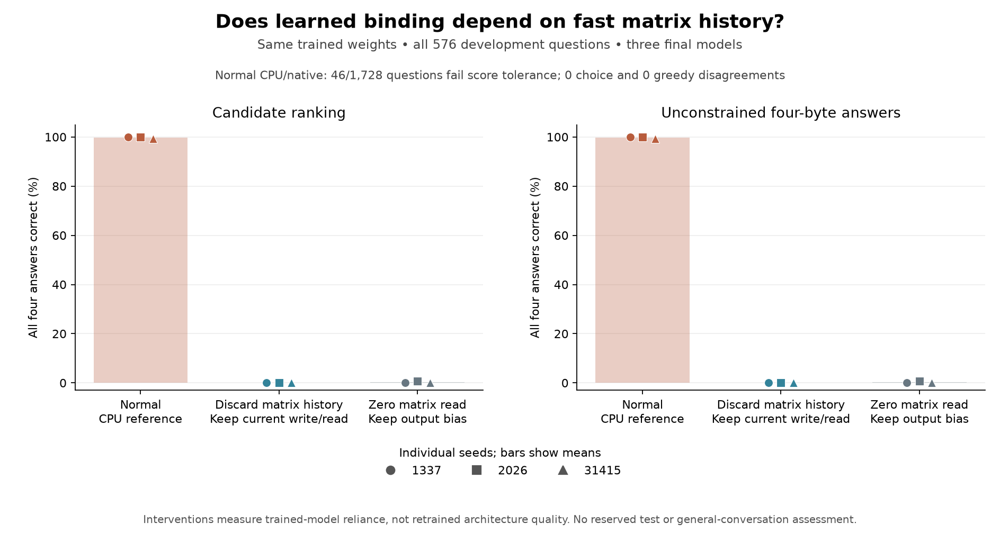

# Does learned binding use fast matrix history?

All three associative models from the [longer learning comparison](associative-long.md) depend on stored matrix history for the measured binding task. Clearing only that history before each byte reduces complete development-group accuracy from a mean **99.77% to 0%**. This is a read-only intervention in the independent CPU reference, with fixed learned weights and all 576 original development questions per model.

The [follow-up protocol](associative-long.md#follow-up-does-the-trained-model-use-matrix-history) was declared after observing the first seed's learning/retention tradeoff and before running any intervention. It includes every seed's final 130,000-observation checkpoint. No model was selected by its performance, no parameters were changed, and reserved tests remain unused. The native learner remains C++/CUDA.

## Interventions and results

| Mode | What changes | Seed 1337 | Seed 2026 | Seed 31415 | Mean |
| --- | --- | ---: | ---: | ---: | ---: |
| Normal | Original CPU equations | 100.00% | 100.00% | 99.31% | **99.77%** |
| Discard history | Clear matrix history before every byte; retain that byte's write/read | 0.00% | 0.00% | 0.00% | **0.00%** |
| Zero read | Zero the matrix read vector before its output projection | 0.00% | 0.69% | 0.00% | **0.23%** |

Each score requires all four questions in a group to be correct. Candidate ranking and unconstrained four-byte generation give the same group scores in every condition. All interventions retain learned projection parameters, output bias, membranes and spike traces. The history condition preserves current-byte computation, so its collapse distinguishes reliance on associations across bytes from the extra branch's immediate transformation alone.



Mean individual-answer accuracy is 99.94% normally, 50.41% when history is cleared and 49.94% with zero reads. Context-erased accuracy stays at 50% in every condition. There are two candidates per question, drawn from the four familiar location words box, bag, bed and car.

These interventions change downstream activation distributions. They establish reliance within these trained models, not how an alternative architecture would perform after retraining or whether the matrix alone is sufficient. They do not establish general conversation, biological memory, durable knowledge retention or a speed advantage. The original models still forget earlier reading more than their controls.

## Full normal-path audit: answers agree, some scores do not

The normal reference evaluates every original development question in all three final associative models: **1,728 question instances**. Every candidate choice and every generated four-byte answer matches the original native result. Their complete-group accuracies therefore reproduce independently on CPU.

Strict probability-score agreement fails in **46 question instances**. For each question, this check takes the maximum error across its two full-context and two erased-context answer NLLs and compares it with the unchanged `3e-5` tolerance. These are question counts, not counts of individual floating-point values.

| Seed | Questions exceeding score tolerance | Maximum absolute answer-NLL error | Candidate disagreements | Greedy disagreements |
| --- | ---: | ---: | ---: | ---: |
| 1337 | 8 / 576 | 0.232215 | 0 | 0 |
| 2026 | 22 / 576 | 0.771311 | 0 | 0 |
| 31415 | 16 / 576 | 0.198378 | 0 | 0 |

The [full report](../reports/associative-history.json) preserves every failing question ID, all mode/seed aggregates, paired effects, checkpoint/source identities and hashes of the individual score files. It explicitly marks the normal strict score check as failed. The earlier four-question check passed because its selected questions did not expose these failures; the larger audit does not retroactively turn score agreement into a pass.

## Localizing one numerical discrepancy

A [separate diagnostic](../reports/associative-threshold.json) selects the first seed's largest score discrepancy after observing the audit failure. It repeats the complete native four-question group exactly and dumps both candidate traces using the same native forward code in a separately built executable.

The first divergent spike is in zero-based layer 1, byte 62, neuron 441. CPU membrane value **0.9999973178** stays below the threshold; native value **1.0000003576** crosses it. The unmodified score error for the affected candidate is 0.232215 nats. Forcing just that CPU spike to the native positive decision makes all later spike decisions agree and reduces the two candidate-score errors to at most **3.23e-6**.

This local intervention explains the selected discrepancy. The other failures, including the larger seed-2026 error, were not individually traced. It does not relax the tolerance or establish general cross-platform probability equivalence. Saved model files and the study executable remain unchanged.

`tests/trace_comparison.py` shares trace analysis between the older selective and new associative diagnostic drivers. The optional native dump tool now accepts both cells. The extraction reproduces all four earlier selective cases and all **104 native float files** exactly. This adds no duplicate production forward equations and changes no checkpoint format.

## Reproduce

After completing the longer learning comparison:

```powershell
python tests/associative_history.py --fixtures-only
python tests/associative_history.py --root runs/associative-long-panel --out runs/associative-history-panel
python scripts/summarize_associative_history.py
python scripts/plot_associative_history.py

.\build.ps1 -TraceDiagnostic
python tests/associative_threshold.py --out runs/associative-threshold-check
```

Choose fresh output directories or supply the corresponding `--root`, `--history` and `--out` arguments. The trace command requires the preserved study executable at `build/synapticgenesis.exe`; its hash is checked before use. The diagnostic builds in a separate directory. The four-case regression uses `tests/learned_threshold.py --prepare --root runs/shared-trace-regression --exe runs/legacy-b0/synapticgenesis.exe`, where the archived executable must match the earlier ordering study's protocol.
