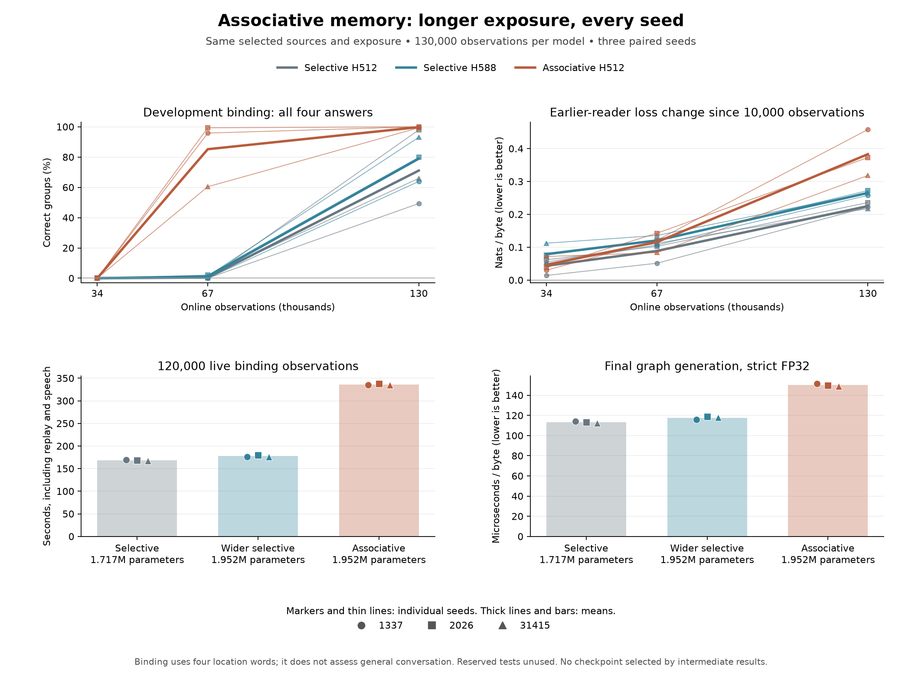

# Longer exposure for the associative learner

## Protocol declared before the full run

The [early screen](associative-memory.md) ended after 24,000 binding observations, fewer than the 51,840 distinct binding documents. All nine models failed complete development groups at that point. The next experiment tests longer exposure with the [optimized runtime](association-runtime.md), without changing the selected source material, architecture or learning settings.

The models again start from random weights. For each seed (1337, 2026 and 31415), the three arms are selective H512, associative H512, and selective H588. All use C256 and four blocks. Their parameter counts remain 1,716,736, 1,951,624 and 1,951,728. The wider selective control has 104 more parameters than the associative arm. Execution order rotates across seeds; GPU studies run sequentially.

Each receives 6,000 reading observations and 4,000 one-object prerequisites, then **120,000 two-object binding observations**. The final stage ends at observation 130,000 and is declared from birth. This changes the original schedule's final endpoint without appending a source stage, which would alter replay allocation. Ordinary resumes preserve the declared schedule; no existing checkpoint's curriculum metadata is patched.

Assessments occur at **34,000, 67,000 and 130,000 observations**. All checkpoints are retained, and every result is reported. The final endpoint is primary. Intermediate outcomes do not select a model, change hyperparameters, change sources or stop poorly performing arms.

The remaining settings match the early screen: 128-byte chunks, base learning rate 0.0003 with one-quarter rate after reading, answer emphasis 64, stage-balanced replay with 1,024 slots every fourth observation, and 96 generated bytes every 500 observations. Learning uses TF32; assessment and decoding use strict FP32. Generation reads the same model and can affect subsequent recurrent state. A content-dependent learning history is therefore possible even with matched observed source bytes.

## Endpoints and checks

- Primary: complete four-question group accuracy on the original development binding assay at 130,000 observations, reporting every seed and the three-seed mean.
- Secondary: exact unconstrained four-byte answers, individual answer accuracy, context-erased controls, original and expanded training monitors, and earlier-reader loss change from the 10,000-observation prerequisite checkpoint.
- Cost: each live segment and total binding-phase time, including replay, speech, logging and checkpoint writes; graph and ordinary decode timings use seven rounds of 512 bytes. Model loading, setup and assessment are outside live timings.
- Execution: matched observed/replay target counts and update counts across arms at each endpoint; same initial common weights for the H512 models; exact graph/ordinary decoding agreement; stable executable, source and checkpoint identities.
- Independent numerics: the existing CPU reference checks one fixed four-question development group per final model. Its strict score tolerance remains `3e-5`. This is not a full CPU audit; hard spike thresholds can amplify small arithmetic differences, which must be reported if observed.
- Early-history control: compare learned weights, Adam arrays and recurrent payloads at observations 10,000 and 34,000 with the archived early-screen files. The new models are trained from scratch; those files supply comparison evidence only. Complete checkpoint files differ because they declare different future schedules.

The binding test partition and the reserved reader remain unused. This assay concerns two object locations, with two answer candidates drawn from `box.`, `bag.`, `bed.` and `car.`; success would not establish general conversation, human developmental ages or open-ended reasoning. Three seeds do not support a broad reliability claim, and this is not a hyperparameter search. Higher reading loss after binding remains a retention regression even if binding improves.

## Reproduce

The existing architecture-screen driver now supports multiple declared endpoints through `--long`. Shared command journaling, source authentication and scoring remain in `scripts/native_experiment.py`; the numerical learner remains entirely native C++/CUDA. The default early-screen invocation is preserved.

```powershell
python scripts/associative_experiment.py --long --smoke --out runs/associative-long-smoke
python tests/associative_experiment.py --root runs/associative-long-smoke

python scripts/associative_experiment.py --long --out runs/associative-long-panel
python tests/associative_experiment.py --root runs/associative-long-panel --early-reference runs/associative-screen-panel
python tests/binding_learned_oracle.py --root runs/associative-long-panel
python scripts/summarize_associative.py --root runs/associative-long-panel
python scripts/plot_associative.py --source reports/associative-long-summary.json --output reports/associative-long-comparison.png
```

The full driver records 144 native commands: nine models, one prerequisite segment and three subsequent learn/assess/decode segments each. The shortened rehearsal records 48 commands for three models. Its tiny update counts validate orchestration only and do not supply learning-quality evidence. The full run writes its protocol before the first model starts, journals commands before execution, and saves partial results after each endpoint.

The [completed rehearsal](../reports/associative-long-execution-smoke.json) passes all 48 commands, initial-common-weight checks, exposure/replay matching and exact graph decoding at nine model/endpoint combinations. The generalized reporting code also reproduces every previously reported early-screen numerical value.

## Completed comparison: better binding, worse reading retention

All nine models completed every declared endpoint. At 130,000 observations, associative memory improves complete development-group accuracy in every seed, including against the approximately parameter-matched wider control. This is a narrow binding gain accompanied by greater forgetting of earlier reading and higher runtime cost.

| Model | Parameters | Complete development groups | Exact greedy groups | Earlier-reader loss increase | Live binding time | Graph decode |
| --- | ---: | ---: | ---: | ---: | ---: | ---: |
| Selective H512 | 1,716,736 | 71.06% | 70.83% | +0.2250 nats/byte | 168.25 s | 113.28 us/byte |
| Selective H588 | 1,951,728 | 78.94% | 78.70% | +0.2651 nats/byte | 177.49 s | 117.65 us/byte |
| Associative H512 | 1,951,624 | **99.77%** | **99.77%** | **+0.3830 nats/byte** | 335.99 s | 150.07 us/byte |

Values are means across all three seeds. Reading change is relative to each model's own 10,000-observation checkpoint; positive values mean worse retention. Binding time sums all three measured segments from observation 10,000 through 130,000, including replay, speech, logs and checkpoint writes. It excludes setup and assessment. Decode uses the final checkpoint, strict FP32 and seven rounds of 512 bytes on the RTX 5080.

| Seed | Selective H512 | Selective H588 | Associative H512 |
| --- | ---: | ---: | ---: |
| 1337 | 49.31% | 63.89% | 100.00% |
| 2026 | 97.92% | 79.86% | 100.00% |
| 31415 | 65.97% | 93.06% | 99.31% |

The associative mean is 28.70 percentage points above the smaller control and 20.83 points above the wider control. At the intermediate 67,000-observation endpoint, its mean is 85.19%, versus 0.46% and 1.16% respectively. At 34,000, all remain at zero. These are three fixed seeds and a declared exposure budget, not a broad reliability estimate or a tuned best-checkpoint result.



The final associative original/expanded training-monitor means are 98.23%/98.69%; the original development assay contains 144 four-question groups, or 576 questions. Its candidate ranking and unconstrained four-byte answers agree on complete groups. Individual context-erased answer accuracy remains exactly 50% for every model. The assay tests changed object locations within four location words; it does not measure general conversation.

The archived early/long protocol text incorrectly names only box/bag. The unchanged [source specification](../data/lessons-binding-v2.json) and all executed assessments include box, bag, bed and car. The prose and plot captions are corrected; archived protocol identities and measured results remain unchanged.

The associative models have greater earlier-reader loss increases than both controls in **every seed**. Mean absolute final reader losses are 2.6109, 2.6278 and 2.7478 for smaller, wider and associative models. Saved samples from `The bird ` still repeat location/answer formats and contain malformed prose. Strong binding therefore does not justify promoting this cell as a better general learner. The [separately selected narrative books](story-corpus.md) are not part of this experiment.

The optimized associative implementation takes **2.00 times** the smaller control's live binding time and **1.89 times** the wider control's time. Final graph generation takes 32.5% and 27.5% longer per byte respectively. It learns the narrow task with fewer observations, but this does not establish a general speed or energy-efficiency advantage. The earlier measured layout speedup remains a comparison against the preserved original associative binary.

## Execution and numerical evidence

The [execution audit](../reports/associative-long-execution.json) verifies all 144 native commands and 27 model/endpoint records. All arms finish with 130,000 observations, 32,500 replay updates, 162,500 total optimizer updates, 9,851,135 observed next-byte pairs, 2,808,933 replay pairs and 24,960 generated bytes. Common initialization matches exactly for the H512 pair; graph/ordinary decoding has identical generated bytes and zero measured state/logit error.

All **18** early-history comparisons reproduce the archived weights, Adam arrays and recurrent payloads exactly: nine models at observations 10,000 and 34,000. These models started from random weights and did not load the archived trained checkpoints. Complete file identities differ because the longer schedule is declared in checkpoint metadata.

The [fixed-group CPU oracle](../reports/associative-long-learned-oracle.json) passes all nine final models, with maximum score error `5.13e-6` against the unchanged `3e-5` tolerance and identical greedy bytes. This checks one fixed four-question group per model, including erased-context scores. It is not a full CPU audit. The additional associative-model diagnostic below checks every original development question and must report any threshold-sensitive discrepancies separately.

The [full learning records](../reports/associative-long-language.json) and [summary](../reports/associative-long-summary.json) retain every seed, endpoint, sample, paired difference, checkpoint identity and timing. Reserved binding and reader tests remain unused. Native runtime code and checkpoint format did not change in this reporting stage.

## Follow-up: does the trained model use matrix history?

After observing the first seed's binding improvement and reading regression, a separate read-only diagnostic is planned for all three final associative models. It does not alter the running training protocol or select an intermediate checkpoint. The independent CPU reference will evaluate every original development question under three interventions:

| Mode | Intervention |
| --- | --- |
| Normal | Original equations; compare scores and greedy bytes with all native development results. |
| Discard history | Clear only the fast matrix before each byte, preserving the current byte's write/read, projection weights, output bias, membranes and spike traces. |
| Zero read | Zero the matrix read vector before its output projection, preserving the output bias and other model equations. |

The history intervention tests the contribution of associations across bytes beyond the branch's instantaneous transformation. The zero-read intervention tests reliance on the memory readout as a whole. Both change downstream activation distributions, so they measure reliance within a trained model, not the learning potential of a retrained smaller architecture. Every checkpoint remains unchanged. All 576 development questions and all three seeds are included; reserved tests remain unused.

`tests/associative_history.py` records the protocol and source hashes before intervention, saves all scores and generated answers, and reports strict CPU/native numerical failures without loosening the `3e-5` tolerance. Literal overwrite/decay controls check the interventions and preserve the output bias. The runtime implementation is unchanged.

The [control validation](../reports/associative-history-validation.json) passes all three literal modes and both default CPU autograd fixtures. The [completed learned-model intervention](associative-history.md) reduces mean complete-group accuracy from 99.77% to 0% when matrix history is cleared, and to 0.23% with zero reads. All 1,728 normal-path CPU answer choices and generated answers match CUDA, but 46 questions exceed the strict score tolerance. The report retains those failures and a localized single-spike explanation for one case.

```powershell
python tests/associative_history.py --fixtures-only
python tests/associative_history.py --root runs/associative-long-panel --out runs/associative-history-panel
```
