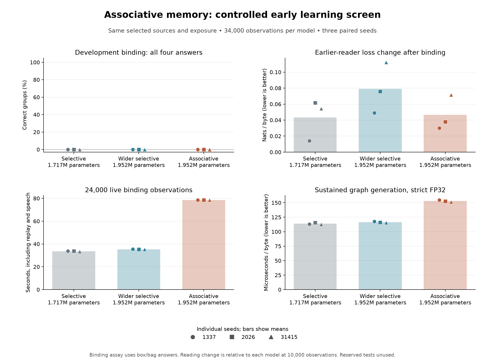

# Fast associative state in the shared spiking learner

`--cell associative` selects the experimental `signed_associative_trace_lif_v6`. It adds a small, learned key/value memory to each selective spike-trace block. The memory changes during every forward pass, including generation. Slow projection weights still learn through the existing surrogate-gradient and AdamW path. This is one native model with two timescales of adaptation, not separate training and inference models.

The design is motivated by [memory-enriched spiking networks with Hebbian plasticity](https://arxiv.org/abs/2205.11276) and the decay-plus-delta update in [Gated Delta Networks](https://arxiv.org/abs/2412.06464). The former trains slow connections to use a fast associative memory; the latter supplies a content-correcting matrix recurrence. Our fixed-width byte model uses its own signed spike traces and dense CUDA projections. It does not reproduce either paper's full architecture, data protocol, optimized parallel algorithm or results. Backpropagation and simulation ages remain engineering choices, not a model of human development.

## Forward rule

Each block projects its filtered spike emission into 32-dimensional query, key and value vectors and two scalar gates. Query and key divide by `sqrt(sum(vector^2) + 1e-5)`. Values use `tanh`; both gates use `sigmoid`.

```text
P[t]       = decay[t] * M[t-1]
error[t]   = value[t] - P[t] * key[t]
M[t]       = P[t] + write[t] * error[t] * transpose(key[t])
read[t]    = M[t] * query[t]
x_next[t] += W_memory * read[t] + b_memory
```

The matrix has 32 rows and 32 columns, independently for each block and batch sequence. A write corrects the association along the current key rather than simply adding the same association indefinitely. With normalized keys and gates in [0,1], the homogeneous matrix transition is non-expansive. This describes the recurrence's linear part; it is not a guarantee of semantic retention or an absolute bound on every state value.

Reading after the current input's write is causal for next-byte prediction. Target labels never enter this forward path. Prompt and generated bytes can update the matrix and affect the following observed chunk, just as they already affect neuron state. Forward-only execution changes transient state, not Adam moments or slow weights.

Initialization uses a separate random stream for the new projections. Common parameters remain identical to the same-sized selective model at the same seed. Decay starts at `exp(-1/128)`, write strength at `1/8`, and the memory readout at zero. The initial output therefore recovers the existing selective cell. The readout learns on its first update; its nonzero values then allow gradients into storage and retrieval projections.

## State, learning and ownership

`src/associative_memory.cuh` owns feature normalization, forward and reverse matrix recurrence, and scratch allocation. `Model` invokes that component within its existing shared forward/backward path. The CPU reference in `tests/associative_reference.py` is used only for verification.

The reverse kernel differentiates through the complete matrix recurrence inside a chunk. Incoming matrix state is detached at chunk boundaries. It uses one writer per destination with fixed reduction order. The current implementation traverses timesteps sequentially within one CUDA block per sequence; it does not implement a parallel scan and has no presumed speed advantage.

Live execution views share the resident matrix along with neuron state and slow parameters. Replay uses separate transient state. A document reset clears all three: membrane, filtered spike trace and associative matrix. A live checkpoint stores the matrix, while ordinary evaluation starts from fresh state. Architecture ID 6 distinguishes these layouts from existing IDs; the separate live-extension version remains unchanged.

Population inheritance copies each donor block's learned memory projections. When hidden width grows, added projection columns are zero, as are the new neurons' ordinary outgoing weights. This preserves inherited behavior at birth. The child starts with empty transient state and fresh optimizer history. Inherited learned projections are not an inherited transcript of a parent's experiences. Existing fitness, resource, lifespan and dead-parent rules apply to this architecture.

## Cost and validation

At C256/H512/L4, the model has **1,951,624 parameters**, compared with 1,716,736 for the selective cell. Persistent recurrent state for one stream grows from 16,384 to **32,768 bytes**, including four 32-by-32 float matrices. Parameters, gradients, Adam moments, weight-decay masks, matrix caches and reverse-pass scratch all enter the population accounting. CUDA/cuBLAS overhead and the live engine's additional execution views still need reserve; the single-Model buffer estimate is not process-wide peak memory.

Native tests cover literal key/value overwrite and decay, sequence isolation, causality, target exclusion, forward-only writes, state ablation, learning from the zero readout, streamed/chunked/graph equivalence, full resume and replay isolation. Existing curriculum, stage replay, optional SI, growth, scarcity and old-age checks include architecture 6. Independent CPU autograd checks every parameter tensor with nonzero incoming membrane, trace and matrix state, including answer emphasis, spike activity regularization and Adam.

```powershell
.\build.ps1
python tests/oracle.py build/associative-test-results
python tests/oracle.py build/feedback-test-results/associative
python tests/population_live_cli.py --cell associative --replay stage --out runs/associative-population-check
python tests/population_cli.py --cell associative --out runs/associative-scarcity-check
```

Numerical and lifecycle correctness do not establish better language learning. This cell remains optional, with LIF still the default. A controlled learning comparison must report reading retention, held-out binding answers, live cost and any regressions together.

The [recorded validation](../reports/associative-validation.json) passes 15 native suites and 13 independent CPU gradient fixtures. The unweighted associative fixture's maximum logit/gradient errors are `8.94e-8` / `3.73e-8`; weighted errors are `1.04e-7` / `1.19e-7`. Its chunk/step maximum state-or-logit difference is `1.29e-6`, graph/step difference zero, and saved live learning resumes exactly on this GPU. Existing selective-cell float fixtures remain byte-identical to the archived pre-change binary. Broader learned-model threshold sensitivity remains subject to the [previous numerical finding](curriculum-order.md#numerical-finding-and-independent-audit).

## Declared learning screen

The first comparison uses seeds 1337, 2026 and 31415 with three arms: selective H512 (1,716,736 parameters), associative H512 (1,951,624), and selective H588 (1,951,728). The wider selective arm has 104 more parameters than the associative arm, providing an approximate parameter-count control. Every model starts from random weights; same-sized arms share their initial common parameters, not a trained ancestor.

All receive the same selected diversity material: 6,000 reading observations, 4,000 one-object prerequisites and 24,000 two-object binding observations. The source order, 128-byte chunks, learning rates (`0.0003` then one quarter), answer emphasis (64), stage replay (1,024 slots, every fourth observation) and graph speech (96 bytes every 500 observations) match. Arms rotate execution order across seeds. Models can generate different content, which enters their continuing recurrent streams.

The primary endpoint is complete-group accuracy on the original development binding assay after 34,000 observations. Secondary measures are unconstrained four-byte answers, original and expanded training monitors, earlier-reader loss change since 10,000 observations, live-loop time and strict-FP32 graph decoding. The reader and binding test partitions remain reserved. This is an early screen with fewer binding observations than distinct selected binding documents; it cannot establish convergence, optimal hyperparameters or general conversation.

```powershell
python scripts/associative_experiment.py --smoke --out runs/associative-screen-smoke
python scripts/associative_experiment.py --out runs/associative-screen-panel
python tests/binding_learned_oracle.py --root runs/associative-screen-panel
```

The driver writes protocol and source/executable identities before training, journals each command, preserves the prerequisite and final checkpoints, checks matched exposure/replay counts and authenticates its inputs again at completion. The smoke run verifies orchestration only.

## Result: no binding gain at the early endpoint, with higher runtime cost

All nine models completed the declared screen. Every model received 2,747,295 online target pairs, 788,450 replay target pairs, 34,000 online updates, 8,500 replay updates and 6,528 generated bytes. This is 42,500 total optimizer updates per model. Source and replay exposure match exactly across all arms and seeds.

The table reports arithmetic means across all three seeds. Reading loss is in nats per byte; its change is measured from each model's own 10,000-observation prerequisite checkpoint, with lower values better. Live time covers the subsequent 24,000 observations including replay, speech, logging and checkpoint writes. Graph timing is the mean of each model's seven-round median, with 512 generated bytes per round, strict FP32 and no model loading included.

| Model | Parameters | Development complete groups | Individual answer accuracy | Final reader loss | Reader loss increase | Live binding phase | Graph microseconds/byte |
| --- | ---: | ---: | ---: | ---: | ---: | ---: | ---: |
| Selective H512 | 1,716,736 | 0% | 49.65% | 2.4292 | +0.0434 | 33.63 s | 113.76 |
| Selective H588 | 1,951,728 | 0% | 50.06% | 2.4417 | +0.0790 | 35.36 s | 116.51 |
| Associative H512 | 1,951,624 | 0% | 49.54% | 2.4114 | +0.0466 | 78.57 s | 153.06 |



The associative cell has lower absolute final reader loss than both controls at each tested seed. It also began the binding phase with better average reading loss than the smaller baseline. Its average *loss increase* during binding is slightly worse than that smaller baseline, and better than the similarly sized control. Absolute reading loss and retention therefore give different comparisons; neither establishes useful binding.

Both candidate ranking and unconstrained four-byte generation score zero on complete development groups for every model. Individual answers stay near the 50% two-choice level; context-erased accuracy is exactly 50%. Original training-group accuracy averages 0%, 0.23% and 0.15% for the smaller selective, wider selective and associative arms respectively. The models have not reliably fitted the relational task at this early endpoint. The screen does not establish which architecture would perform best after longer exposure.

The original binary used in this screen costs **2.34 times** the smaller baseline's measured live binding time and **2.22 times** the approximately parameter-matched control's time. Graph generation takes about 35% and 31% longer per byte respectively. Its normal-update p95 histogram estimate is 5.93 ms for each seed, versus approximately 2.24–2.34 ms for the controls. The histogram has approximately 2.2% relative bin width. These are local RTX 5080 measurements, not portability or energy-efficiency claims. A subsequent [CUDA layout optimization](association-runtime.md) measures the revised runtime against this preserved binary.

Generated samples from `The bird ` fall into repeated lesson patterns such as `Answer: bag.` or `Answer: box.` and malformed fragments. General conversation remains unestablished. The cell stays experimental and the default remains LIF; this screen does not justify promotion as a better general learner.

The [fixed-group learned CPU check](../reports/associative-learned-oracle.json) passes all nine models, with maximum candidate-score error `3.62e-6` and identical greedy answers. This checks four fixed development questions per model, including erased-context scores. It is not a full CPU audit of all 576 questions. Graph and ordinary decoding produce identical bytes, logits and state in all measured rounds. The reserved test partitions were not scored.

Complete artifacts are the [learning records](../reports/associative-language.json), [summary with every seed and sample](../reports/associative-summary.json), and [execution smoke check](../reports/associative-execution.json). Regenerate the summary and figure with:

```powershell
python tests/associative_experiment.py --root runs/associative-screen-panel
python scripts/summarize_associative.py
python scripts/plot_associative.py
```

## Follow-up performance experiment

The [measured layout experiment](association-runtime.md) retains the original binary as a control. Padding alone regressed; caching backward inputs, padding the reverse matrices and retaining forward matrix cells in registers improved the measured recurrence cost. It reports whole-live-loop timing and complete learned-checkpoint comparisons separately from isolated kernel timings. The equations and checkpoint format are unchanged.

The [next declared learning comparison](associative-long.md) extends exposure from birth to 130,000 observations, with assessments at 34,000 and 67,000 as well. It keeps all three seeds and architectures, sources and learning settings, and reports retention and runtime together with final binding results.
