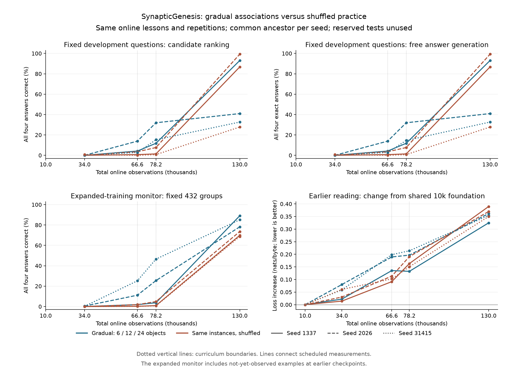

# Gradual associations versus shuffled practice

The [selected lesson expansion](lesson-diversity.md) improved final development accuracy but learned slowly and unevenly. This experiment tests whether first practicing associations among a smaller set of objects makes later broad learning more reliable. It compares an ordered curriculum with the **exact same online document instances and repetitions shuffled**. Both arms receive the same total online practice; their replay contents can differ as a consequence of ordering.

[Bengio et al. (2009)](https://icml.cc/2009/papers/119.pdf) studied learning schedules that begin with simpler examples and expand their support. That motivates the hypothesis, not a guaranteed improvement. [Oba et al. (2023)](https://aclanthology.org/2023.conll-babylm.25/) tested sentence-complexity curricula for BabyLM and found that their curricula did not outperform the baseline. Ordering needs a controlled experiment in this native spiking learner. Neither study equates these observation counts with human ages.

## Matched selected material

The [policy](../data/curriculum-order-v1.json) uses the already selected 24 nouns, four locations, literal templates and source-derived answers. The original six development/test object pairs stay excluded. Original training/development/test probes and the preselected expanded-training monitor are unchanged.

Both arms receive the same common foundation: 6,000 reading observations followed by 4,000 single-fact prerequisite observations covering all 24 names. Thus the growing restriction below applies to **two-fact associations**, not to the first appearance of every word.

| Association phase | Objects eligible in ordered arm | Observations | Total observation endpoint |
| --- | ---: | ---: | ---: |
| Initial associations | First 6 | 56,640 | 66,640 |
| Broader associations | First 12 | 11,520 | 78,160 |
| Full selected associations | All 24 | 51,840 | 130,000 |

The object order is the published selected vocabulary order. Complete four-question reversal groups are sampled through shuffled cycles; their individual document instances are then shuffled within each phase. The last two phases each cover their complete eligible sets. Every selected binding document therefore appears in the final schedule.

The control globally shuffles those same 120,000 instances, then cuts the stream at the same phase boundaries. At the final endpoint, both arms have observed all 51,840 unique selected binding documents, with exactly the same frequency for each one: 40,320 documents once, 9,792 twice, 384 thirty-four times and 1,344 thirty-five times. Both observe 8,879,952 binding target-byte pairs. Earlier endpoints can have different byte exposure and content coverage.

Repeated documents are explicit practice instances. They are not counted as new unique content. Each phase is a single native pass over its planned instances using `new` scope. The generic unique-material extension preparer keeps its existing duplicate rejection; this separate selected-exposure preparer validates every repeated instance against the canonical lesson set.

## Shared model history and protocol

Seeds 1337, 2026 and 31415 reuse the exact archived 6,000-observation reading founders from the diversity experiment. Those founders were trained from random weights on the selected sources. Native append-only extension adds the common prerequisite stage, ending at 10,000 observations. Its weights, Adam moments and recurrence are checked against the corresponding archived prerequisite checkpoint from the previous experiment. The new schedule metadata is allowed to differ.

Both arms resume the same complete common checkpoint per seed. The model remains selective-trace C256/H512/L4, with 1,716,736 parameters, chunk 128, TF32 learning, ordered gradient reductions, learning rate 0.0003 and a 0.25 multiplier for lesson stages. Answer emphasis remains 64. The shared native model generates 96 bytes every 500 observations; those generated bytes never become targets.

Stage-balanced replay uses 1,024 slots and an update every four observations. Both arms have five source stages and the same stage boundaries. Once all stages have filled, their quotas are 205/205/205/205/204. The lesson composition of those stages, and consequently the replay history, differs with the ordering. This experiment tests the complete ordering intervention under that fixed replay policy, not a hypothetical learner without replay.

The primary endpoint is the unchanged development joint-group accuracy at **130,000 observations**. Scores at 34,000, 66,640 and 78,160 describe the trajectory; no favorable checkpoint is selected. Unconstrained exact answers, original/expanded training monitors, earlier-reader loss, exposure and cost accompany the primary endpoint. The expanded monitor draws from the final selected training set; some of those examples have not yet been observed at early measurement points. Neither the reserved binding tests nor the reserved reader book are scored.

Five replay groups give reading a smaller share than the previous three-stage expansion experiment. That earlier experiment is historical context, not the matched control here. Retention must be measured explicitly; a developmental stage boundary does not itself establish mastery or improved memory.

## Preparation and reproduction

After preparing the selected diversity edition and its three reading ancestors:

```powershell
python scripts/prepare_curriculum_order.py
python tests/curriculum_order.py --out runs/curriculum-order-data-check
python scripts/diversity_experiment.py --smoke --out runs/curriculum-order-refactor-smoke
python scripts/order_experiment.py --smoke --out runs/curriculum-order-smoke
python tests/binding_learned_oracle.py --root runs/curriculum-order-smoke
python scripts/order_experiment.py --out runs/curriculum-order-panel
python tests/binding_learned_oracle.py --root runs/curriculum-order-panel
python tests/binding_cpu_audit.py --root runs/curriculum-order-panel
python scripts/summarize_order.py
python scripts/plot_order.py
```

The experiment accepts `--prepared` and `--ancestry-root` for other locations. An ancestor must match its recorded source and executable identity; a changed build cannot silently relabel an earlier founder. All output directories must be fresh. The common native runtime and checkpoint format are unchanged.

The [preparation report](../reports/curriculum-order-validation.json) records the passed checks. The data test independently parses all 51,840 unique fact/query labels, verifies the actual 120,000-instance multisets, checks full reversal grids within ordered phases, reproduces prepared bytes, preserves probe identities and rejects altered selections or held-out content. The native smoke run exercises all five stages and restarts at their boundaries with graph speech and replay active: 34 commands and eight assessed checkpoints.

Shared command journaling and binding assessment now live in `scripts/native_experiment.py`; the common trained-model CPU check lives in `tests/binding_learned_oracle.py` with the earlier entry point retained. After extraction, all seven complete checkpoint files from the previous smoke run reproduced byte-for-byte, and the CPU oracle reproduced the earlier six-model report. A real seed-1337 continuation through the new common prerequisite schedule preserved all 20,617,216 compared bytes of weights, Adam moments and recurrence against the archived earlier prerequisite checkpoint. This checks numerical continuity despite changed schedule metadata.

Those historical extraction comparisons use local archives and are recorded as absent when unavailable in a fresh reproduction. Current data checks and the native smoke/CPU checks remain required. The full experiment independently requires identical prerequisite arrays against its own corresponding diversity ancestors for every seed. Python preparation and experiment orchestration use the standard library; CPU references require the existing NumPy/PyTorch test dependencies, and the figure uses Matplotlib.

The three seeds vary model initialization, not the lesson-order seed. This compares one declared schedule with one declared global shuffle under stage replay. The repeatedly used development set supports iteration; it is not an independent final test of the selected approach.

The final report also preserves the existing 96-byte live generation at observation 130,000 from every arm and seed, including its fixed `The bird ` prompt, byte representation and transcript hash. These are qualitative examples from the ongoing live stream, not another scored endpoint or additional training data.

With the published checkpoints, the fixed-group CPU command above saves all six results and exits with a score-tolerance failure for seed 31415's gradual arm. Keep that failure visible; the subsequent full-development audit and the diagnostic below investigate it. Historical extraction checks and the five-cell reference-hook check can be absent in a fresh collection and are then recorded as absent.

## Completed comparison

The [99-command native experiment](../reports/curriculum-order-language.json) completed all 24 declared assessments on an RTX 5080 with CUDA 13.3 and driver 616.64. Each pair resumed its identical 10,000-observation checkpoint, and all three prerequisite continuations matched their archived earlier weights, Adam moments and recurrence byte-for-byte. The [summary](../reports/curriculum-order-summary.json) preserves every final model, checkpoint identity, exposure count, live sample and numerical caveat.

At the declared **130,000-observation endpoint**, the gradual schedule improves two seeds slightly and regresses severely in the other:

| Seed | Shuffled development groups | Gradual development groups | Gradual minus shuffled | Earlier-reader loss: shuffled → gradual |
| --- | ---: | ---: | ---: | ---: |
| 1337 | 86.81% | 93.06% | +6.25 points | 2.77539 → 2.71046 |
| 2026 | 99.31% | 40.97% | -58.33 points | 2.74788 → 2.73991 |
| 31415 | 27.78% | 32.64% | +4.86 points | 2.74395 → 2.74797 |
| Mean | **71.30%** | **55.56%** | **-15.74 points** | **2.75574 → 2.73278** |

Each group requires all four answers to be correct. Final unconstrained exact-answer generation gives the same group scores as candidate ranking in every model. Context-erased assessment gives zero complete groups at every measured checkpoint.

The gradual arm leads every seed at 78,160 observations: 11.81%, 31.94% and 15.28%, compared with 1.39%, 7.64% and 0.69% for shuffled practice. Its final expanded-training monitor also scores higher in every seed, averaging **84.18% versus 70.76%**. Those advantages do not establish better final generalization: seed 2026 is the clearest counterexample. Original-training group accuracy averages **95.14% for gradual practice versus 97.15% for shuffled practice**. The monitor samples 432 groups and does not measure the complete expanded training set.

Earlier-reader loss rises from the common 10,000-observation foundation by a mean **0.34692 nats/byte with gradual practice versus 0.36988 with shuffled practice**. That is a small average retention improvement, with one paired regression. From the original 6,000-observation reading founder, the increases are 0.47350 and 0.49646. Every final model has lost some earlier-reading performance. The saved live examples contain repeated lesson answers and incoherent prose; structured question accuracy has not become general conversation.



This particular gradual schedule remains experimental. It has not earned a change to the default curriculum, automatic stage promotion or a biological-age interpretation. The mean regression, wide seed variation and remaining forgetting are material outcomes, not checkpoints to discard. Different phase lengths, sequence seeds or replay policies would be new experiments.

## Matched exposure and cost

| Quantity | Shuffled | Gradual |
| --- | ---: | ---: |
| Parameters | 1,716,736 | 1,716,736 |
| Online observations | 130,000 | 130,000 |
| Total optimizer updates, including replay | 162,500 | 162,500 |
| Source target-byte pairs, including common history | 9,851,271 | 9,851,271 |
| Replay target-byte pairs | 2,747,894 | 2,746,538 |
| Generated bytes | 24,960 | 24,960 |
| Replay slots / saved policy bytes | 1,024 / 24,912 | 1,024 / 24,912 |
| Mean measured live continuation time | 167.59 s | 167.71 s |

Both arms see the same final online document multiset and all 51,840 unique selected binding documents. Reading-stage replay exposure is also identical at 1,277,384 target-byte pairs; prerequisite replay contributes 430,730 pairs in each arm. Later replay contents differ with ordering, producing the small total replay-byte difference above. These counts are identical across the three seeds within each arm.

The measured live continuation covers 120,000 observations after the common foundation, including replay, graph speech, logging and checkpoint I/O. Setup and separate assessments are excluded. Gradual practice takes 0.071% more time on average in this one realization per seed, which does not establish a throughput difference. Final ordinary-update p95 is 2.190 ms and speech-update p95 is 14.417 ms in all six models. These are histogram upper bounds with approximately 2.2% bin width.

The earlier three-stage diversity experiment has a different replay allocation and exposure distribution. Its results cannot serve as the matched control for these five-stage schedules.

## Numerical finding and independent audit

The [fixed-group CPU check](../reports/curriculum-order-learned-oracle.json) passes its 3e-5 score tolerance for five final models and **fails for seed 31415's gradual model**, whose maximum error is 0.02183. Checked greedy answers still match. The check now records all models before returning failure, rather than discarding the report when the first numerical discrepancy appears. Its tolerance has not been relaxed.

A separate native trace executable reuses the existing CUDA forward computation and leaves the study executable unchanged. For the affected two questions and both candidate answers, the first divergent spike is neuron 472 at byte 58 in layer 2, using zero-based indices. CPU membrane value **-0.9999979734** produces no spike; CUDA value **-1.0000010729** produces a negative spike. Both are within a few millionths of the -1 threshold. Repeating the original native evaluation produces identical results.

Overriding just that single CPU spike with the native decision makes all subsequent spike choices agree and reduces the four candidate-score errors to at most **1.44e-6**. This diagnostic localizes the selected discrepancy; it does not turn the independent strict check into a pass. The trace evidence is included in the summary.

The subsequent [full CPU audit](../reports/curriculum-order-cpu-audit.json) checks all **576 development questions in all six models**, using the independent CPU forward calculation without that override. Every candidate choice and every four-byte generated answer matches CUDA: zero disagreements across 3,456 questions. Thus all final group accuracies and the reported curriculum comparison reproduce on CPU.

Numerical scores themselves are less stable: **53 of 6,912 two-candidate score comparisons** exceed 3e-5, with a maximum error of **1.53562 nats**. Each comparison contains two answer scores under either full or erased context. The detailed single-spike trace explains the selected failing case; other larger discrepancies were not individually traced. Agreement in these categorical answers does not establish general probability agreement, universal cross-platform reproducibility or stability on different inputs.

Diagnostic hooks in the CPU reference preserve its ordinary path. The existing five-cell probe suite passes 59 native commands with a maximum fixture score error of 1.91e-6; previous six-model and smoke reports also reproduce unchanged. These small-fixture successes are separate from the failed strict check on learned models.

To reproduce the localized case after the full study, build the diagnostic separately and choose a fresh output directory:

```powershell
.\build.ps1 -TraceDiagnostic
python tests/learned_threshold.py --prepare --root runs/curriculum-order-threshold-check
python tests/probes_cli.py --exe build/synapticgenesis.exe --out runs/curriculum-order-reference-hooks-check
python scripts/summarize_order.py
```

The optional executable is `build/trace-diagnostic/synaptic-trace-diagnostic.exe`. `learned_threshold.py` prepares the exact fixed questions, journals the native repeat and four trace dumps, then performs the single-spike intervention. It targets this published seed/arm discrepancy; it is not a general replacement for the strict CPU oracle. Training, saved checkpoints and the study's executable remain unchanged.
