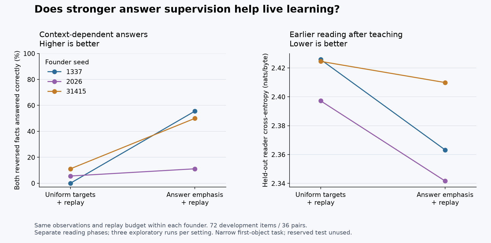

# Context-dependent language and teaching lessons

Book cross-entropy is insufficient to establish useful language behavior. The native `language-probes` command tests whether a model changes its answer when a fact changes, while the question and available answers stay identical. It also removes the facts entirely as a control and measures greedy generation without constraining the output to the choices.

The optional [selected lesson specification](../data/lessons-relations-v1.json) contains original literal templates and a small vocabulary. Its examples are deterministic expansions, not another downloaded corpus or imported model knowledge. This is a narrow teaching experiment alongside the selected books; it does not replace the general-language curriculum.

```powershell
python scripts/prepare_lessons.py --out data/prepared/relations-v1
.\build\synapticgenesis.exe language-probes --checkpoint runs/development-replay/latest.ckpt --probes data/prepared/relations-v1/development.sgprobe --output runs/development-probes.json
```

Preparation produces 312 training documents (24,071 bytes), 216 training probes, 72 development probes and 72 reserved test probes. Lessons introduce a location, distinguish two objects, or change a location. Development/test probes use the two-object form and hold out ordered object pairs across every location combination and both answer directions. All words and syntax are familiar. This tests generalization to selected new combinations; it does not test unseen grammar or general reasoning. Prepared manifests record exact hashes and assert that held-out fact contexts never appear in training documents. The test partition is reserved for a declared later assessment, not development tuning.

For example, the question `Where is the key?` must produce different answers after `The key is in the box. The hat is in the bag.` and after `The key is in the bag. The hat is in the box.` The order of candidate strings stays fixed. A constant preference for one answer can achieve 50% item accuracy but cannot answer both members of a reversed pair correctly.

## Native scoring protocol

`SGPROBE1` starts with a magic string and item count, followed by records containing quoted ID, pair ID, skill, integer correct-choice index, quoted context, query, choice 0 and choice 1. Quoted fields follow C++ `std::quoted` escaping and may contain actual newlines. Every pair must contain exactly two different contexts, identical queries/choices/skill and opposite labels. Duplicate IDs, malformed pairs and trailing input are rejected before writing results.

Each candidate starts from zero recurrent state. Only answer bytes contribute to summed negative log probability; the first answer byte is predicted by the final prompt byte. Scores are not divided by candidate length. The selected lesson alternatives have equal lengths. Greedy generation uses a fixed budget equal to the longer candidate, independent of the label, and must match the complete correct string. For unequal candidates this strict metric penalizes a shorter answer followed by extra generated bytes. Byte values outside printable ASCII are escaped individually in the JSON diagnostic strings.

Results include individual scores and output, aggregate item accuracy, accuracy of answering both members of each pair, greedy exact answers, answer-only byte loss, and the context-erased control. With context erased, paired accuracy must be zero; this is a runtime invariant against accidental state or label leakage. The scorer uses strict FP32, verifies that weights and both Adam moment arrays remain unchanged, and never writes the checkpoint. Existing reports are protected against accidental overwrite.

`python tests/probes_cli.py --out runs/probes-cli-test` checks both LIF and ALIF against an independent CPU forward implementation. It verifies answer-byte alignment, full candidate scores, unconstrained greedy outputs, order independence, file preservation, invalid-input rejection and exact corpus reproduction. The [recorded check](../reports/probes-cli.json) passed 20 native invocations with maximum score difference below 2e-6.

## Initial finding

The book-trained production checkpoint achieved 50% item accuracy, 2.78% paired accuracy and no exact greedy answers on the 72 development items. A lesson-only live pilot at learning rate 0.0003, 12,000 observations and no old-source replay reduced training loss but reached only 48.61% item accuracy and zero paired accuracy. Its old-reader cross-entropy deteriorated from 2.21085 to 12.88267. Continuing for 24,000 additional observations at 0.0001 raised item accuracy to 61.11% and paired accuracy to 22.22%; this is still weak performance after extensive repetition.

These are failed or incomplete learning controls, not a recommended model. The initial failure also occurred on the training combinations, so it cannot be explained solely by a difficult held-out split. The evidence calls for better answer supervision and retention, followed by testing the model's temporal dynamics. The reserved test probes have not been evaluated.

This first task always asks about the first named object. A successful model could learn to copy the first location; success would establish a narrow dependence on context, not arbitrary object binding or multi-step reasoning. Later assessments need queries about either object and variations in sentence order and syntax.

## Explicit answer supervision with older-source replay

The version-3 schedule can increase the weight of actual answer bytes without using generated text as targets. To prepare a comparison from the selected books and lessons:

```powershell
python scripts/prepare_lessons.py --out data/prepared/teaching-v1 --reading data/prepared/development-v2-final/through-stage-4.dat

.\build\synapticgenesis.exe live --checkpoint runs/development-replay/latest.ckpt --curriculum data/prepared/teaching-v1/answer-64.sg --out runs/teaching-emphasis --lr 0.0003 --chunk 128 --replay reservoir --replay-capacity 1024 --replay-every 4 --graph --speak-every 500 --tokens 96 --prompt "The bird " --fast --validation data/prepared/development-v2-final/13853.txt --eval-batches 32

.\build\synapticgenesis.exe language-probes --checkpoint runs/teaching-emphasis/latest.ckpt --probes data/prepared/teaching-v1/development.sgprobe --output runs/teaching-emphasis/development.json
```

Run the `answer-1.sg` schedule into a separate directory for the uniform-target control. Both start from the same supplied book checkpoint, refresh reading for 6,000 observations, then introduce 12,000 lesson observations at a quarter base learning rate, with reservoir replay every four observations. They have the same source ordering, observations and replay budget. Each run performs its own reading phase; floating-point nondeterminism can make the states at the lesson boundary diverge. This is a whole-protocol comparison, not an exact common-boundary checkpoint ablation. These explicit commands use a new live stream, so they retain supplied weights/moments but initialize new replay/history; subsequent `--resume` retains the complete teaching stream.

The lesson answer multiplier is 64 for the emphasis run and 1 for the control. All lesson documents fit into the requested chunk. The additional per-target GPU scratch storage is four bytes per target in each execution view; replay, weights, optimizer and graph inference remain shared as before. This is selected-source supervision; frozen parental distributions and automatic teacher feedback remain unimplemented.

The [recorded comparison](../reports/teaching-v1.json) uses three existing founder checkpoints (original seeds 1337, 2026 and 31415), two runs per founder, and the [hashed teaching editions](../reports/teaching-v1-manifest.json). The first checkpoint came from the ordinary reading-to-science live profile; the other two came from the earlier retention experiment's quarter-rate replay arm, which tracked zero-strength SI. Both settings within each founder use exactly the same supplied checkpoint. Results below are averages on the 72 development items:

| Measure | Uniform targets + replay | Answer emphasis + replay |
| --- | ---: | ---: |
| Correct candidate choice | 48.15% | **67.59%** |
| Both reversed contexts correct | 5.56% | **38.89%** |
| Exact unconstrained greedy answer | 26.85% | **52.31%** |
| Both greedy answers in a pair correct | 1.85% | **21.30%** |
| Earlier reader loss after teaching | 2.41583 | **2.37155** |
| Increase in reader loss during lessons | +0.27935 | **+0.23366** |
| Geography loss after teaching | 2.12978 | **2.09244** |



Answer emphasis improved candidate accuracy, paired accuracy, greedy exact accuracy and reader loss in each of these three comparisons. Geography loss improved in two of three. Variation is substantial: paired accuracy with emphasis ranged from 11.11% to 55.56%. Removing context still gave 50% item accuracy and zero paired accuracy. These are exploratory development results after choosing the intervention from the earlier pilot, not independent confirmation on the reserved test set. Scores do not establish useful general dialogue or arbitrary entity binding, and both settings still forget some earlier reading.

Each run observed 1,669,212 source pairs, replayed 502,455 pairs over 4,500 replay updates, and generated 3,456 bytes during 18,000 live observations. Mean loop time was about 25.5 seconds for either setting on this RTX 5080. Mean of per-run ordinary-tick p95 values was 4.79 ms for uniform targets and 4.74 ms with emphasis; update-plus-96-byte-speech p95 means were 19.02 and 21.39 ms. These fixed-order, single-host timings include the stated live loop's I/O and do not establish a speed advantage. The optional `scripts/plot_teaching.py` regenerates the figure using Matplotlib.
