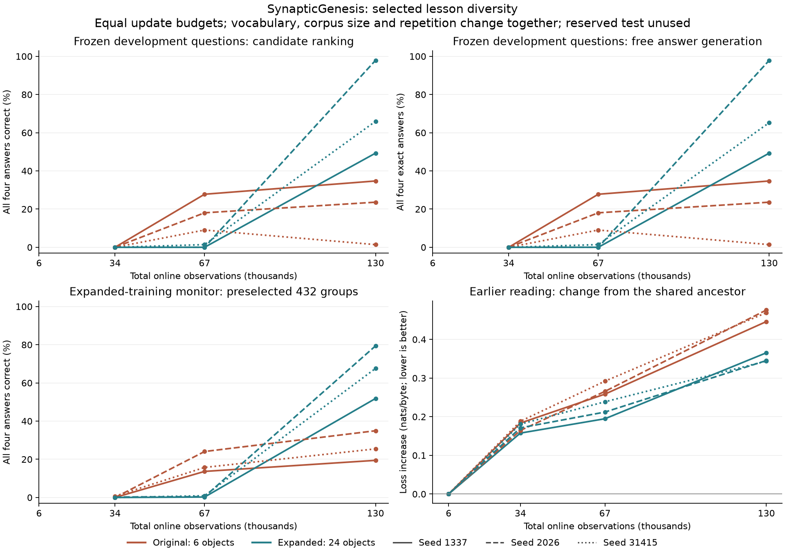

# Selected lesson diversity

The current selective-trace model can fit the original binding lessons while its accuracy on new object combinations varies widely across seeds. This experiment asks whether a more varied selection of simple lessons helps it reuse the fact/query rule. It retains the same native C++/CUDA live learner and earlier-reading sources.

## Research motivation

[Zhou, Jiang and Bansal (2023)](https://aclanthology.org/2023.emnlp-main.898/) found that training-data diversity, complexity and repetition affect compositional generalization in Transformer experiments. Their results motivate varying these factors; they do not establish the effect for this spiking model. [Andreas (2020)](https://aclanthology.org/2020.acl-main.676/) studied recombining compatible fragments for compositional data augmentation. Our literal selected-noun expansion is a separate intervention, not an implementation of that paper's GECA procedure.

[Ruis and Lake (2022)](https://arxiv.org/abs/2202.10745) found that augmentation alone could fail in a gSCAN baseline, while a modular architecture made better use of it. More examples are therefore a hypothesis to test, not a presumed fix for the model's memory or generalization limitations. These are machine-learning studies, not evidence that model update counts represent human developmental ages.

## Selected material and unchanged assessment

[The selection file](../data/lessons-binding-diversity-v1.json) adds eighteen concrete three-letter object nouns to the original six. The four locations, two fact forms, two query forms and answer format stay unchanged. All labels follow the stated facts. There are no imported weights, teacher predictions or downloaded synthetic examples.

| Property | Original control | Expanded lessons |
| --- | ---: | ---: |
| Object names | 6 | 24 |
| Training object pairs | 9 | 270 |
| Single-fact prerequisite documents | 96 | 384 |
| Two-fact training documents | 1,728 | 51,840 |
| Complete four-question training groups | 432 | 12,960 |
| Original development groups | 144 | The same 144 |
| Original reserved-test groups | 144 | The same 144 |

Every question asks for one object's location after two facts. Each four-question group reverses both the queried object and the fact-to-location assignment. Always copying the first or last location scores half the individual questions and zero complete groups. All orders, assignments and templates for the original six development/test object pairs remain excluded from training. Exact held-out contexts are also checked against the selected reading and every generated training document.

Original `train.sgprobe`, `development.sgprobe` and `test.sgprobe` are copied byte for byte. Here `train.sgprobe` continues to mean the **original six-object training set**. A separate `expanded-train-monitor.sgprobe` samples 432 complete groups from expanded training with the declared seed 917203. It is fixed before learning, fits the native parser's item limit, and is **not full expanded-training accuracy**. For the control it includes unfamiliar object combinations; for the expanded arm it is a training sample. The primary development questions are identical in both arms.

The change increases vocabulary diversity, corpus size and the number of combinations together, reducing repetition at the same update budget. It does not isolate vocabulary size alone. The small, fixed grammar is not a broad dialogue corpus or an age-calibrated teaching curriculum.

## Declared paired experiment

Three seeds, 1337, 2026 and 31415, each train a founder from random weights for 6,000 reading observations. Both arms resume that seed's **same complete learned checkpoint**. Native append-only curriculum extension adds either the original or expanded lessons while preserving earlier weights, optimizer history, recurrent state and replay. Both branches receive 4,000 prerequisite observations, then 120,000 two-fact observations, ending at 130,000 total.

Both arms use selective-trace cells, C256/H512/L4, chunk 128, TF32 learning, fixed-order gradient reductions, learning rate 0.0003 with a 0.25 lesson-stage multiplier, answer emphasis 64, and 1,024 stage-balanced replay slots. Replay updates occur every four observations. Every 500 observations, the same shared model generates 96 bytes; generated text is not a training target. Both arms retain 342 reading, 341 prerequisite and 341 binding replay windows once the three stages have filled their slots.

The primary endpoint is original development **joint group accuracy at 130,000** observations. Original training accuracy, the expanded-training monitor, unconstrained exact answer generation, earlier-reader loss, target-byte exposure and live timing accompany it. Predeclared observations at 34,000 and 67,000 show the trajectory; they are not candidates for selecting a favorable checkpoint. No trained model is evaluated on the reserved test partition.

Equal observation and replay-update counts do not guarantee equal target-byte counts. Source order, window length and replay selection can change that exposure. Reports preserve those counts. Live timing sums the continuation segments after the common ancestor and includes replay, speech, logging and checkpoint I/O; setup and held-out evaluation are outside it. Run order alternates across seeds and measurement points. There is one timing realization per arm/seed, not a dedicated throughput benchmark.

## Preparation and validation

After preparing the existing `binding-v2` selected edition:

```powershell
python scripts/prepare_binding_diversity.py
python tests/binding_diversity.py --out runs/binding-diversity-validation
python tests/binding_cli.py --out runs/binding-refactor-validation
python scripts/diversity_experiment.py --smoke --out runs/binding-diversity-smoke
python scripts/diversity_experiment.py --out runs/binding-diversity-panel
python tests/diversity_learned_oracle.py --root runs/binding-diversity-panel
python scripts/summarize_diversity.py
python scripts/plot_diversity.py
```

The preparation refuses changed base hashes and existing output directories. The experiment authenticates prepared inputs, records source/executable/checkpoint identities, and writes its protocol before native training. The smoke mode checks extension, resume, grouped scoring and matched counters with only 128 observations; it cannot establish learning quality.

Independent tests parse all 52,992 generated question/answer rows, check all 13,248 four-question groups and prerequisite labels, verify pair exclusion and monitor membership, and reproduce both old and new prepared bytes. Negative controls reject malformed selections and held-out contexts hidden in reading or templates. A disposable native test checkpoint reads the complete monitor; eight rows also receive independent CPU scoring and greedy-generation checks. The original five-cell binding tests cover the shared renderer extraction.

Model computation remains native. `binding_lessons.py` owns shared literal rendering, preparation scripts own their selected editions, and `experiment_checkpoint.py` provides read-only checkpoint evidence for experiment drivers. The native loader remains responsible for full checkpoint validation.

The [validation report](../reports/lesson-diversity-validation.json) records successful preparation/negative controls, the original ten-command five-cell binding check, and a 25-command native smoke run through extension, scoring and two resumes per branch. Eight expanded-monitor rows match independent CPU scores within 1.44e-6, and their greedy answers match exactly. Eighteen historical checkpoint views still match their published hashes, dimensions and replay distributions after helper extraction. The native executable is unchanged from the previously validated fourteen-suite ordered-reduction stage; this data stage did not rebuild it.

The independent CPU checks require the same NumPy/PyTorch test dependencies as `tests/probes_cli.py`; the figure additionally uses Matplotlib. Preparation and the experiment driver use Python's standard library. The historical checkpoint-view extraction check is optional in a fresh report collection and is recorded as absent when its archived evidence is unavailable. A different executable is not attributed the previous native build's fourteen-suite validation.

## Completed paired comparison

The [75-command native experiment](../reports/lesson-diversity-language.json) completed all eighteen measurements on an RTX 5080 with CUDA 13.3 and driver 616.64. The [summary](../reports/lesson-diversity-summary.json) preserves source and checkpoint hashes, all seeds, exposure counts and measured cost. Both arms of each seed resume the exact same learned reading ancestor. No trained model was scored on either the reserved binding tests or the reserved reader book.

At the declared **130,000-observation endpoint**, expanded lessons improve development accuracy in all three seeds:

| Seed | Original development groups | Expanded development groups | Change | Earlier-reader loss: original → expanded |
| --- | ---: | ---: | ---: | ---: |
| 1337 | 34.72% | 49.31% | +14.58 points | 2.68828 → 2.60746 |
| 2026 | 23.61% | 97.92% | +74.31 points | 2.74463 → 2.61387 |
| 31415 | 1.39% | 65.97% | +64.58 points | 2.73660 → 2.61125 |
| Mean | **19.91%** | **71.06%** | **+51.16 points** | **2.72317 → 2.61086** |

Each development group requires four correct answers. Unconstrained exact answer generation also improves: its mean group accuracy rises from **19.91% to 70.83%**. It matches the candidate-ranking group count except for one expanded group in seed 31415. Erasing the context gives zero complete correct groups at every measured checkpoint.

This is a late benefit. At 67,000 observations, expanded development accuracy is only 0%, 0% and 1.39%; the controls are ahead at that point. The third control later deteriorates from 9.03% to 1.39% despite reaching perfect training accuracy. These trajectories are why the predeclared final endpoint and every seed remain in the report.

Original-training group accuracy averages **99.77% for the control and 68.60% for expansion**. The expanded-training monitor averages **66.28%** in the expanded arm (51.85%, 79.40%, 67.59% by seed). The control scores 26.62% on that monitor, which includes object combinations it was not taught. The expanded model has not mastered its larger teaching set; neither its original-training subset nor the sampled monitor measures full expanded-training accuracy.

Earlier-reader loss increases from each shared ancestor by a mean **0.46389 nats/byte in the control versus 0.35158 with expansion**. All three paired comparisons improve, but every final model still forgets some earlier reading. Reading-stage replay target-byte exposure is identical in both arms: 1,534,152 pairs, including the ancestor's history.



## Exposure, cost and numerical verification

| Quantity | Original control | Expanded lessons |
| --- | ---: | ---: |
| Parameters | 1,716,736 | 1,716,736 |
| Online observations | 130,000 | 130,000 |
| Total optimizer updates, including replay | 162,500 | 162,500 |
| Source target-byte pairs observed | 9,851,391 | 9,851,135 |
| Replay target-byte pairs | 2,810,217 | 2,808,933 |
| Generated bytes | 24,960 | 24,960 |
| Replay slots / saved policy bytes | 1,024 / 24,832 | 1,024 / 24,832 |
| Mean live continuation time | 172.48 s | 173.67 s |

The mean measured continuation time is **0.69% higher** with expansion. This includes 124,000 new observations after the common ancestor, replay, graph speech, logging and checkpoint I/O. It excludes setup and held-out evaluation and is not a repeated throughput estimate. Ordinary-update p95 is 2.238 ms for the controls and 2.238–2.287 ms for expansion; speech-update p95 is 14.417–14.733 ms. Those percentiles are histogram upper bounds with approximately 2.2% bin width. No model-size or GPU speed improvement is claimed.

The control completes 69 full online passes over binding documents plus 768 more documents; expansion completes two full passes plus 16,320 documents. Prerequisite exposure similarly changes from 41 full passes plus 64 documents to ten passes plus 160. Replay is excluded from those pass counts. Independently summing each document's within-document byte pairs reproduces every model's observed exposure count.

The [trained-model CPU check](../reports/lesson-diversity-learned-oracle.json) evaluates one fixed four-question development reversal group in **all six final models**, using the independent CPU forward implementation. Full-context and context-erased candidate scores match native FP32 scores within **5.13e-6**, and the checked greedy answers match exactly. Checkpoint files remain unchanged. This is a numerical check of a fixed group, not a second quality benchmark or cross-platform reproducibility guarantee.

The results support the expanded selection as an experimental teaching option at this budget. Vocabulary diversity, corpus size and repetition changed together, so this does not isolate their individual effects. The large seed range, remaining forgetting, incomplete training fit and narrow grammar still prevent a claim of reliable mastery or general conversation. Gradual introduction of more varied lessons and associative memory are separate follow-up hypotheses; neither is demonstrated by this comparison.
