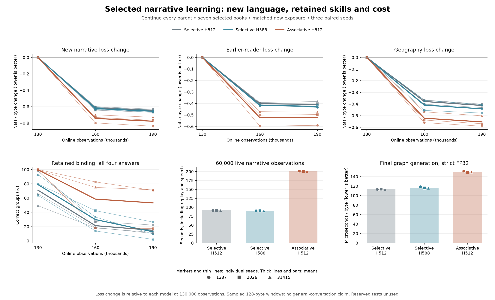

# Continuing existing models on selected narrative books

## Protocol declared before the full run

The associative models now learn a small binding task reliably, but [earlier reading regresses](associative-long.md) and their generated prose remains dominated by lessons. The next experiment continues every final model on the [seven selected narrative books](story-corpus.md), using the existing shared C++/CUDA live learner. It tests broader text learning and retention without changing architecture or introducing teacher-generated targets.

The three architectures and seeds remain fixed: selective H512, selective H588 and associative H512; seeds 1337, 2026 and 31415. All nine start from their own authenticated **130,000-observation** checkpoint, including weights, Adam history, source counters, replay and generation RNG. They are this project's from-scratch models. No best seed or intermediate checkpoint is selected.

A native append-only curriculum admission adds the seven books as **one pooled stage**, ending at observation **190,000**. Assessments occur before admission and at **160,000 and 190,000**. The final endpoint is primary; all results are retained. The observed stream repeats the seven books in the prepared edition's fixed order, including short tail windows. This is not a test of the preparation's short-to-long content grouping or automatic developmental promotion.

The new stage uses 128-byte chunks, learning-rate multiplier 0.25 on the preserved 0.0003 base rate, and ordinary next-byte loss. Previous lesson documents retain their answer emphasis of 64 when replayed. Live generation keeps its original prompt, 96 bytes every 500 observations, and the same mutable model. Observed targets update slow weights; generated text is never a learning target. Learning remains TF32 and separate evaluation is strict FP32.

## Replay and state boundaries

The inherited stage reservoir retains its history during admission. Introducing the fourth source group then uses the existing quota rule: 1,024 total windows become **256 per source stage**, with old groups uniformly reduced from 342/341/341. Lifetime seen/replay counters remain intact, and replay occurs every fourth observation. Old reading, prerequisites and binding remain eligible. This change in the data mixture is part of the declared experiment, not a claim that every old replay descriptor is retained.

The normal source-boundary reset clears transient membranes, traces and fast matrices when the first new book starts, just as at other document boundaries. It preserves learned parameters and optimizer history. Resumed observations within a document keep their recurrent state. The experiment copies parent checkpoints to new output directories and never writes over the originals.

## Measures and limits

- **Primary:** change in held-out *The Velveteen Rabbit* byte loss between the parent and observation 190,000.
- **Retention:** separate loss changes for *New National First Reader* and *Home Geography for Primary Grades*, plus all 576 original development binding questions and their four-question group scores.
- **Generation:** two fixed prompts, `The bird ` and `Once upon a time `, at every endpoint; 384 generated bytes, temperature 0.8, top-k 40, seed 42. Publish every sample, not selected successes. These standalone samples use fresh recurrence and do not enter learning; speech within the live session retains the original shared-state protocol.
- **Cost:** each live segment and total narrative-phase time, including replay, speech, logs and checkpoint writes; setup and separate assessments are excluded. Final decoding uses seven rounds of 512 bytes, checking exact graph/ordinary agreement.
- **Execution:** authenticated sources and parents, preserved prefix stages and replay counters, independently counted source target pairs, matched exposure across architectures, and exact interrupted/uninterrupted continuation in the shortened rehearsal.
- **Numerics:** one fixed four-question CPU check per final model under the unchanged `3e-5` tolerance. The earlier full audit found threshold-sensitive score differences, so any new failures must remain visible.

Book losses use 32 deterministic batches of 16 reset-state windows of 128 bytes: 65,536 sampled target bytes per book, which can overlap or repeat. Report each book separately; their lengths and difficulty differ. This does not measure complete books, long-story comprehension, conversational instruction following or biological age. The two reserved books and reserved binding questions are never scored. Three seeds and a fixed exposure budget are not a hyperparameter search or a claim of broad reliability.

The prepared edition contains 1,744,439 training bytes including document separators. Its source/cleaned hashes and earlier contamination checks remain authoritative. The new driver authenticates individual books, split assembly and the selected specification before using the common curriculum-extension preparer. All model computation stays native.

## Reproduce

```powershell
python tests/story_corpus.py --out runs/narrative-source-check
python scripts/narrative_experiment.py --smoke --parent runs/associative-long-smoke --out runs/narrative-smoke
python tests/narrative_experiment.py --root runs/narrative-smoke --continuation-control

python scripts/narrative_experiment.py --out runs/narrative-panel
python tests/narrative_experiment.py --root runs/narrative-panel
python tests/binding_learned_oracle.py --root runs/narrative-panel
python scripts/summarize_narrative.py --root runs/narrative-panel
python scripts/plot_narrative.py
```

The full run journals **180 sequential native commands**, with no concurrent GPU study. The rehearsal uses the three existing short-run seed-1337 parents, endpoints 256/384, 64-byte samples and two validation batches. Its 60 commands plus three uninterrupted controls check execution only.

The [completed rehearsal](../reports/narrative-execution-smoke.json) passes source/exposure authentication, inherited counters, all four replay quotas, repeated reader evaluation and exact graph decoding. Split and uninterrupted learning produce identical complete checkpoint files for all three architectures. Three additional default binding-assessment calls reproduce every earlier score, answer and metadata field; elapsed wall times are excluded from that comparison. The source audit reproduces 22 narrative and 20 prior corpus files, with the original paragraph/context contamination checks unchanged.

## Completed comparison: book loss improves while binding is lost

All nine models completed both new endpoints. Every model improves all three held-out book losses relative to its own parent, but every model loses complete binding accuracy. The two measurements capture different behavior: more fluent byte prediction does not ensure retention of an earlier relational skill.

Mean byte cross-entropy across the three seeds is shown below. Lower is better within a book; arrows run from observation 130,000 to 190,000.

| Model | New narrative loss | Earlier-reader loss | Geography loss |
| --- | ---: | ---: | ---: |
| Selective H512 | 2.24396 → 1.59727 | 2.61086 → 2.20340 | 2.26205 → 1.84972 |
| Selective H588 | 2.24500 → 1.58848 | 2.62781 → 2.20202 | 2.28234 → 1.84126 |
| Associative H512 | 2.35710 → 1.57918 | 2.74782 → 2.22667 | 2.39028 → 1.83661 |

The associative cell reduces narrative loss by 0.77793 nats/byte, compared with 0.64670 and 0.65652 for the controls. It starts from worse book loss after the preceding binding phase, so comparing those reductions alone would exaggerate the final architectural difference. Final narrative loss is 0.01809 below the smaller control and 0.00930 below the wider control on average; earlier-reader loss remains worse on average. This continuation compares models with different learned capabilities, not identical parent weights.

Complete development binding requires all four answers in a reversal group to be correct. The individual seed results retain the considerable variation:

| Seed | Selective H512 | Selective H588 | Associative H512 |
| --- | ---: | ---: | ---: |
| 1337 | 49.31% → 11.81% | 63.89% → 2.08% | 100.00% → 70.83% |
| 2026 | 97.92% → 22.22% | 79.86% → 26.39% | 100.00% → 17.36% |
| 31415 | 65.97% → 10.42% | 93.06% → 9.72% | 99.31% → 71.53% |
| Mean | **71.06% → 14.81%** | **78.94% → 12.73%** | **99.77% → 53.24%** |

The associative model retains more complete groups in two seeds, but does worse than both controls in seed 2026. Its mean loss is 46.53 percentage points. Greedy exact-answer group accuracy at the final endpoint averages 15.05%, 12.73% and 52.55%, respectively; it is separate from choosing the lower-loss candidate. Context-erased individual-question accuracy stays at 50% for every model. None of this establishes reliable lifelong retention.



The [complete results](../reports/narrative-language.json) and [summary](../reports/narrative-summary.json) retain all 27 checkpoint assessments and all **54 fixed samples**. Inspection of every final sample finds story vocabulary and occasional recognizable phrases mixed with misspellings, broken sentences and repeated question/answer templates. Useful conversation and coherent sustained prose remain unproven. The samples use one declared sampling setting and are not a separate statistical fluency assessment.

## Exposure and measured cost

Each model observes **7,677,365 new target-byte pairs**, replays **1,437,145 pairs** in 15,000 replay updates, and generates **11,520 live bytes** during the 60,000 new observations. Replay descriptors, group counters and exposure match across architectures. Original parent checkpoint files remain unchanged, and all four replay groups finish with their declared 256 windows. The [execution audit](../reports/narrative-execution.json) independently counts the new source windows and verifies all 180 commands and 27 checkpoints.

| Local RTX 5080 measurement, mean of three seeds | Selective H512 | Selective H588 | Associative H512 |
| --- | ---: | ---: | ---: |
| Narrative live loop, seconds | 91.10 | 90.33 | 200.86 |
| Final graph decode, microseconds/byte | 113.35 | 116.77 | 150.11 |
| Final ordinary decode, microseconds/byte | 301.71 | 301.45 | 491.29 |

The associative live phase costs about 2.20× the smaller control and 2.22× the wider control in this run. Its graph decoding costs 32.4% and 28.5% more per byte. Live timing includes replay, speech, logs and saves, excluding setup and separate evaluation. Decode uses seven 512-byte rounds including sampling/transfers/synchronization, excluding prompt warmup and capture. Every final model produces exactly identical graph/ordinary bytes, logits and state. These are local workload measurements, not an energy-efficiency claim.

## Numerical limitation and diagnosis

The [fixed-group CPU check](../reports/narrative-learned-oracle.json) tests four development questions per final model. All 36 greedy answers agree with native execution. Eight models pass the unchanged `3e-5` score tolerance; seed 1337's wider selective model fails, with maximum absolute score difference **0.00620496**. The failing check exits unsuccessfully and preserves its complete report. No full development CPU audit was performed for this continuation.

A [post-hoc diagnosis](../reports/narrative-score-diagnosis.json) traces that model's largest checked discrepancy. A fresh native evaluation reproduces its original four-question results exactly. At zero-based layer 2, byte 42, neuron 354, the CPU membrane is 0.9999998808 and the native value is 1.0000005960. They straddle the firing threshold. Forcing only that CPU spike makes every subsequent spike agree and reduces this candidate-score difference to 1.22e-7. This localizes the selected difference; the intervention is not an independent passing oracle and does not overturn the original strict failure.

The generic diagnostic reuses the existing native forward executable and shared CPU trace comparison. It accepts any compatible study's failed fixed-group report, records case selection and source/executable/checkpoint hashes, and never trains a model:

```powershell
.\build.ps1 -TraceDiagnostic
python tests/score_diagnosis.py --study runs/narrative-panel --out runs/narrative-score-diagnosis
```

Use the preserved study executable if the production binary has since changed. Diagnosis and report generation occur after the timing study. This stage changes no native runtime behavior, checkpoint format or reproduction policy.

The next retention experiment should compare source replay with replay that also preserves a frozen earlier model's output distribution, using the same new content, replay windows and exposure budget. Both old skills and new-book learning must be measured: preserving a teacher's mistakes or preventing adaptation would not meet the developmental goal. This is a proposed test, not a demonstrated improvement or an implemented parent-teaching system.
