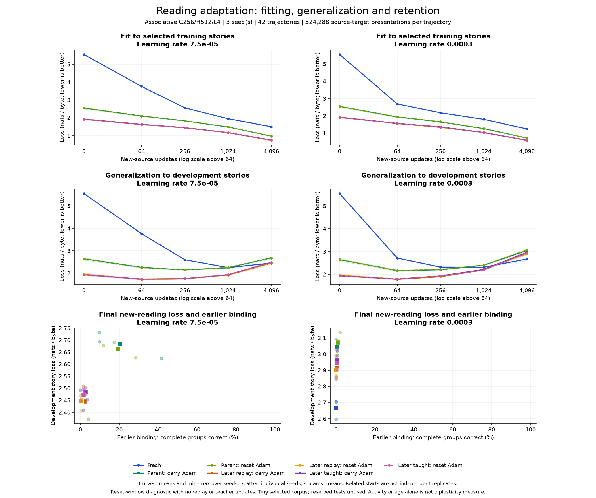

# Reading adaptation: fitting, generalization and retention

The **completed 42-trajectory comparison** finds early improvement on new stories followed by overfitting and loss of earlier skills. All 36 experienced trajectories improve development-story loss after 64 updates, but 34 finish worse than their starting score after 4,096 updates. The [execution audit](../reports/reading-adaptation-execution.json) passes all 210 saved checkpoints. No new learning policy is promoted from this pilot.

## Fixed comparison

The [research design](plasticity-experiment-design.md) and [native diagnostic](adaptation-probe.md) separate three questions: whether a model can fit newly admitted text, whether that helps prediction on other stories, and whether earlier skills survive. The architecture is the existing associative cell with four layers, 256 channels, 512 spiking neurons per layer and 1,951,624 parameters. All model computation uses the shared production C++/CUDA implementation.

Each of three seeds contributes seven starting conditions:

- A fresh model initialized from random weights.
- A model after 130,000 earlier online observations, with either its existing Adam state or zeroed moments and a reset optimizer step.
- Its ordinary-replay continuation after 190,000 observations, with the same two optimizer choices.
- Its frozen-self-teaching continuation after 190,000 observations, with the same two optimizer choices.

The last condition describes the model's earlier history. There is no teacher feedback during this diagnostic. Each seed's experienced conditions share ancestry; they are related comparisons, not independent populations or birth cohorts. Earlier observation counts are not the optimizer-step counts, which include replay. Experience, content and optimization history vary together across the earlier checkpoints, so this experiment does not isolate age as a causal variable.

Both learning rates, **0.000075** and **0.0003**, are retained as separate conditions. Every trajectory receives 4,096 updates of 128 next-byte targets, totaling **524,288 target presentations**. A seed's exact selected windows and order are shared by all starts and both rates. Sampling chooses a training document uniformly and then a valid 129-byte window uniformly. It is not proportional to document length: short stories receive more repeated exposure per byte. The schedule and source identities are saved before learning.

The [selected early-reader edition](early-readers.md) provides ten training stories, three development stories and three reserved test stories. Only training stories provide gradient targets. The small training edition is repeatedly sampled; the update budget is not an equivalent count of unique new facts. The publisher's reading levels do not select a curriculum order in this experiment, and none of these labels establishes human cognitive age.

Native learning uses batch one, 128 targets, strict FP32, unweighted byte loss, AdamW, weight decay 0.01 and gradient clipping at one. Each training and diagnostic evaluation window resets recurrence. No replay, synaptic-importance history or incoming live membrane state is carried into the diagnostic. The `carry` condition preserves weights, both Adam moments and its step count; `reset` preserves exactly the same weights but resets all three optimizer components. It therefore tests the optimizer state as a package, not the isolated effect of one moment.

## Measurements and interpretation

At updates 0, 64, 256, 1,024 and 4,096, the native diagnostic scores every within-document next-byte pair in the training and development stories exactly once, including shorter final windows. Loss is weighted by byte-pair count. Evaluation must leave weights and optimizer state unchanged. The summary includes a trapezoidal loss-curve area over the actual update counts, divided by 4,096. Lower initial loss can improve that area without establishing greater learning capacity.

At the first and last checkpoints, the ordinary executable assesses the same three earlier evaluation books and the existing independent development binding probes. Each earlier book assessment uses 32 batches of shape 16 by 128. Binding measures complete groups of context-dependent answers, rather than the visual fluency of a sample. Binding retention is interpreted for the previously trained starts; fresh models can answer occasional groups by chance.

Every seed, learning rate, initial score, final score and measured regression belongs in the report. Final loss, loss reduction and curve area answer different questions. A lower training loss with a higher development loss indicates worse generalization on these held-out stories; it does not by itself diagnose global loss of plasticity. One small new source edition cannot establish lifelong learning capacity.

The diagnostic deliberately strips away the complete live retention policy to expose adaptation behavior under a common rule. Its results do not replace the [live retention comparison](teacher-retention.md). Any proposed intervention still needs a matched test in the actual live learning/generation loop.

## Completed comparison: early transfer, then overfitting and forgetting

All **36 experienced trajectories improve training-story loss**. By the declared final endpoint, **34 of 36 have worse development-story loss than their own starting checkpoint**, and all 36 lose earlier binding accuracy. Every experienced trajectory also worsens all three earlier evaluation-book losses: **108 of 108 book comparisons regress**. The whole curves show early development gains followed by deterioration with further exposure. This is evidence of overfitting and forgetting on the chosen edition, while an inability to fit new material is not observed.

The following tables are descriptive means over three seeds. Related starts are paired observations. Loss is in nats per byte, with lower values better; binding is the percentage of complete groups answered correctly, with higher values better. Reset and carry begin with identical weights and identical scores.

| Starting history | Initial training loss | Initial development loss | Initial binding |
| --- | ---: | ---: | ---: |
| Fresh random model | 5.5510 | 5.5495 | 0.23% |
| Earlier parent | 2.5474 | 2.6404 | 99.77% |
| Later ordinary replay | 1.9257 | 1.9537 | 53.24% |
| Later self-teaching | 1.9077 | 1.9310 | 65.05% |

At learning rate **0.000075**, after 4,096 updates:

| Start | Training loss | Development loss | Binding |
| --- | ---: | ---: | ---: |
| Fresh | 1.4994 | 2.4480 | 0.46% |
| Parent, carry Adam | 0.9747 | 2.6834 | 20.37% |
| Parent, reset Adam | 0.9696 | 2.6649 | 19.21% |
| Later replay, carry Adam | 0.7342 | 2.4458 | 2.08% |
| Later replay, reset Adam | 0.7377 | 2.4462 | 0.46% |
| Later taught, carry Adam | 0.7497 | 2.4838 | 2.55% |
| Later taught, reset Adam | 0.7462 | 2.4722 | 1.62% |

At learning rate **0.0003**, after the same 4,096 updates:

| Start | Training loss | Development loss | Binding |
| --- | ---: | ---: | ---: |
| Fresh | 1.2507 | 2.6689 | 0.00% |
| Parent, carry Adam | 0.7215 | 3.0477 | 0.23% |
| Parent, reset Adam | 0.7268 | 3.0729 | 0.93% |
| Later replay, carry Adam | 0.5948 | 2.9231 | 0.23% |
| Later replay, reset Adam | 0.5869 | 2.9003 | 0.00% |
| Later taught, carry Adam | 0.5885 | 2.9651 | 0.23% |
| Later taught, reset Adam | 0.5889 | 2.9441 | 0.23% |

Optimizer reset has mixed effects. For example, at the lower rate, seed 2026's parent loses another **13.19 percentage points** of binding with reset relative to carry, while seed 31415 gains **7.64 points**. Both still forget substantially relative to their original parent. This does not support a universal optimizer-reset remedy or an automatic age-based learning rule.

The learning rate, endpoint and source mixture remain declared conditions. Earlier points with better development scores are descriptive observations; they were not selected as a deployed early-stopping policy. That would require a new declared validation and retention rule, with a further independent assessment. Reserved test stories remain unused.



Curves show means and min-max ranges over seeds, not confidence intervals. Their horizontal axes are linear through 64 updates and logarithmic thereafter. Scatter points show individual seeds and squares show means. Every per-seed result and paired contrast is retained in the [summary](../reports/reading-adaptation-summary.json); the [full measurements](../reports/reading-adaptation.json) include all checkpoints and source identities.

## Research implication

The next useful question is how to retain early transfer benefits without continuing to memorize a tiny repeatedly sampled edition and overwrite earlier skills. A bounded follow-up should vary exposure and the mixture of newly admitted stories with earlier selected-source rehearsal, while reporting both a fixed compute budget and a fixed new-source exposure comparison. More varied selected material can reduce repeated exposure per document, but its benefit must be measured. The [replay and activity-regulation review](homeostasis-and-awake-replay.md) supplies possible mechanisms and their limits.

This pilot supplies no positive evidence for growing or renewing neurons solely because a model has aged. Experienced models can fit the new stories, and resetting their optimizer does not reliably protect older skills. Stronger conclusions about preserved or lost learning capacity need multiple comparable new tasks, suitable starting-loss controls and a complete live-policy comparison. No production learning policy or population fitness threshold is promoted from this pilot.

## Execution and evidence boundaries

The implementation, source schedules, original checkpoints and both executables are authenticated. Intermediate checkpoints include a sidecar binding the source edition, schedule, optimizer policy, ancestor and complete checkpoint bytes. The completed execution audit verifies **42 learning commands, 336 assessment commands and 210 checkpoints**, along with recorded exposures, saved states, evaluation aggregates and unchanged original models, without rerunning model computation.

The [diagnostic validation](../reports/adaptation-probe-validation.json) covers restart equivalence, input rejection, a fresh first-window CPU loss comparison, memory-sanitizer checks and a fourteen-trajectory integration smoke. Those are mechanism checks. They do not establish independent CPU parity for every learned checkpoint in this study. Previously recorded numerical differences near spike thresholds and the strict first-Adam-step tolerance failure remain unresolved.

Synchronized update time totals range from **11.69 to 11.82 seconds per 4,096-update trajectory**, excluding evaluation, checkpointing, logging and process startup. Other desktop GPU contexts are active, so these are not isolated speed benchmarks. The measured peak explicit model allocation is **103,554,060 bytes** per diagnostic, including the temporary evaluation-tail allocation before parameter sharing, and excluding CUDA context and library overhead. Reserved tests remain unused; the research papers are not training data.

The [publication manifest](../reports/reading-adaptation-publication.json) records both original Windows runtime hashes and published-file hashes. Published JSON uses the repository's LF newlines while preserving identical JSON data; internal checkpoint and execution identities refer to untouched runtime artifacts. The PNG is copied byte for byte. Plot provenance includes the source-file and input-report identities. A smoke run verifies this publication path and its refusal to overwrite existing outputs.

## Reproduction

Reproduction requires the authenticated ancestor checkpoints and selected editions from the earlier studies; those large local artifacts are not embedded in the public repository. The published reports identify them by SHA-256. Use fresh output directories.

```powershell
.\build.ps1 -AdaptationProbe
python scripts/adaptation_experiment.py --out runs/reading-adaptation-panel
python tests/adaptation_experiment.py --study runs/reading-adaptation-panel
python scripts/summarize_adaptation.py --study runs/reading-adaptation-panel --out runs/reading-adaptation-panel/summary.json
python scripts/plot_adaptation.py --study runs/reading-adaptation-panel --out runs/reading-adaptation-panel/reading-adaptation.png
python scripts/publish_adaptation.py --study runs/reading-adaptation-panel --plot runs/reading-adaptation-panel/reading-adaptation.png --prefix reports/reading-adaptation
```

The plotting tool requires Matplotlib and NumPy, verifies the execution audit before rendering, and appends `.metadata.json` to the complete image filename. Its output cannot replace a JSON study report by reusing the image basename.
