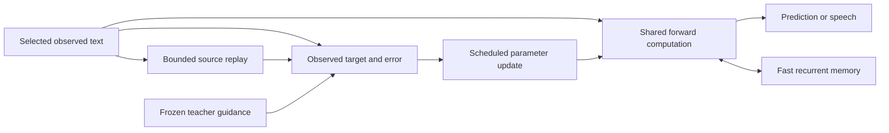

# Research: development, plasticity and live learning

Research review dated **3 October 2026**. The recommendation is to measure how learning capacity changes with experience, then test selective renewal and stabilization in the existing shared runtime. A model's birth date alone is a poor controller for changing all its weights.

This is a design review, not a reproduced result from the cited papers. The [source ledger](../reports/research-live-plasticity-2026-10.json) records evidence types and reading boundaries. Research papers and their datasets do not enter the training allowlist automatically. Founders still start from random weights and learn only from explicitly selected material.

## What our evidence establishes

The [completed narrative comparison](narrative-learning.md#completed-comparison-book-loss-improves-while-binding-is-lost) improved all three assessed book losses in all nine models while reducing earlier binding accuracy. Mean complete binding accuracy fell from 99.77% to 53.24% for the associative cell, from 71.06% to 14.81% for the selective cell, and from 78.94% to 12.73% for the larger selective control. Its fixed generated continuations remain incoherent.

That establishes forgetting during successful new learning. It does **not** diagnose an inability to learn new material. The [frozen-self comparison](teacher-retention.md) tests a retention intervention; its full execution and numerical audits were still pending when this review was prepared. Partial outcomes are not used to choose settings here. The pending teacher-buffer optimization changes storage cost, not the learning objective.

We need separate measures of:

| Property | What to measure |
| --- | --- |
| Retention | Earlier book losses and independent skill probes after new learning |
| Plasticity | Improvement on fresh, comparable learning tasks over a fixed exposure budget, relative to declared controls |
| Language quality | Held-out prediction plus fixed continuations and independently scored comprehension; lower byte loss alone is insufficient |
| Runtime cost | End-to-end update/speech latency, resident bytes, replay/teacher overhead and additional diagnostic state |

Existing [dynamics inspection](../scripts/inspect_dynamics.py) describes learned weights and passive decay times. It does not measure activity diversity, functional importance or learning capacity.

## Biological evidence and its limits

**Stable connections coexist with turnover.** Yang, Pan and Gan tracked mouse cortical dendritic spines during development and learning. Their observations combine formation and pruning with a smaller, persistent subset. This supports studying selective stabilization; it does not justify making every connection stronger or less plastic as a model gets older. The evidence concerns particular mouse circuits, not universal human age bands. [Primary study, 2009](https://pmc.ncbi.nlm.nih.gov/articles/PMC4724802/)

**Recent modification can affect subsequent plasticity locally.** Flores, Sarkar and Zito found a temporary refractory period after potentiating individual spines in cultured mouse hippocampal slices. A recently changed synapse can therefore behave differently from its neighbors. The reported biological timescale is not a training schedule for a CUDA model. A temporary per-feature update modifier would be our engineering hypothesis. [Primary study, 2025](https://www.pnas.org/doi/10.1073/pnas.2410433122)

**Multiple memory timescales can interact.** Benna and Fusi's theoretical synaptic models couple fast and slow variables bidirectionally to resist overwriting. This is more specific than freezing old weights, and its storage-capacity results depend on the model assumptions. It is not a demonstrated language-learning algorithm for our network. [Paper abstract and figures, 2016](https://www.nature.com/articles/nn.4401)

For SynapticGenesis, keep population lifetime, generation number and curriculum exposure separate from a feature's update history. Candidate local statistics are time since initialization, recent modification, contribution across old and new sources, and protection evidence. These are proposed measurements, not validated biological ages. A quiet feature can still encode a rare useful skill.

## Algorithms relevant to one live learner

**Continual backpropagation:** Dohare and colleagues distinguish loss of plasticity from forgetting and test replacement of low-utility mature units in vision and reinforcement learning. Utility and maturity guards are useful hypotheses; replacing an existing unit can still change behavior. Their result does not establish plasticity loss, or a suitable replacement rate, in this spiking language model. [Nature, 2024](https://www.nature.com/articles/s41586-024-07711-7)

**Eligibility propagation:** Bellec and colleagues combine forward-computed local eligibility traces with a learning signal. Practical online e-prop approximates credit assignment rather than reproducing arbitrary backpropagation through time exactly. Adaptive neurons can require multiple eligibility components per synapse. It is a serious candidate for online learning, with learning-quality and state-memory costs to measure. [Nature Communications, 2020](https://www.nature.com/articles/s41467-020-17236-y)

**Learning inside recurrent state:** test-time training makes hidden state a small learner updated by a self-supervised objective. This connects prediction with adaptation, but changing context state does not itself establish permanent retention in general model weights. The published study uses much larger models than ours. [Sun et al., ICML 2025](https://proceedings.mlr.press/v267/sun25h.html)

Our existing associative matrix already changes during the shared forward pass. Observed-source replay and AdamW update slower parameters. These are different memory mechanisms in one model, not separate deployed training and inference models. A useful next design preserves that ownership:

The diagram describes the current ownership and information flow. Eligibility traces, feature renewal and additional consolidation variables remain proposals. Speech alone supplies no verified target. A local update still needs a useful credit signal; simultaneous use and learning do not require updating every parameter on every byte.

## Spiking language models worth testing against

| Reference | Relevant evidence and boundary |
| --- | --- |
| [URCHIN, September 2026 preprint](https://arxiv.org/html/2609.13899v1) | A 128-neuron recurrent spiking core, about 4.23M stored parameters; embeddings and output head hold 99.2%. Uses 16,384-token BPE and 10M/100M-word tracks, with backpropagation. Appendix B reports 90 prediction flips across 445,447 comparisons between parallel and serial execution. Its throughput measurement is a full sequence forward pass. Code and weights were not inspected. |
| [SpikingBrain, 2025 technical report](https://arxiv.org/html/2509.05276v1) | The 7B/76B models use conversion and continued pretraining. They offer large-model architecture and deployment ideas; they do not demonstrate training our small selected-corpus learner from scratch. |
| [At Most One Spike per Neuron, September 2026 preprint](https://arxiv.org/html/2609.05151v1) | Time-to-first-spike coding is a different representation. Energy is estimated with a proxy, not measured on neuromorphic hardware; timing quantization can hurt language results. Sparse events alone do not establish lower CUDA latency or energy. |
| [Winner-Take-All Spiking Transformer, April 2026 preprint](https://arxiv.org/html/2604.11321v1) | Competition replaces softmax attention in a much larger language-model setting. The energy comparison uses assumed operation costs. It motivates a bounded competition experiment, not a measured speedup for this runtime. |

A fair first architecture comparison would keep our selected corpus and byte vocabulary fixed and test modest lateral recurrence or competition. Changing recurrence, tokenization, data volume and optimizer together would hide which change helped. A later tokenizer experiment must train its vocabulary on selected training material only. Different tokenizations should be compared using original-text likelihood per byte and end-to-end generated text cost, not raw token throughput or token perplexity.

## Neuron-indexed storage under real memory pressure

[PowerInfer](https://arxiv.org/html/2312.12456v1) supports the broader locality idea: frequently active neurons stay on GPU, while CPU-resident neurons can be computed on the CPU. Its predictors sometimes miss active neurons, and the paper measures resulting task-score changes. It is an approximate sparse execution system, not an exact disk-paging guarantee.

For our traced cells, [the actual emitted signal](../src/trace_neuron.cuh) is a spike plus a weighted continuous trace. No spike does not mean zero output. Input projections and associative cues also currently use dense weights. Predicting a spike and skipping the corresponding data can therefore change the computation.

Two separate experiments are possible. Prefetching can preserve results if every required miss is serviced before computation. Predicted skipping requires a declared approximation and a quality test. Benchmark either under an actual oversized working set, recording misses, transfer bytes, predictor cost, CPU/GPU work and update invalidation. Compare the same model and workload against resident and ordinary offload baselines where feasible. A larger model makes memory pressure relevant; it does not by itself remove transfer cost.

## Recommended experiment order

These are candidate designs. Exact sizes, source identities, rates and acceptance margins must be declared before running them.

1. **Diagnose adaptation separately from forgetting.** Use repeated new tasks of comparable difficulty with disjoint selected examples. Compare experienced checkpoints, a matched fresh model and a single-model continuation. Report starting performance and the full improvement curve, rather than interpreting a better starting point as better plasticity. Keep exposure and optimizer policy explicit; an optimizer-reset diagnostic must be a separately labeled control. Recheck earlier skills at each endpoint. Record per-feature activity, emitted contribution, saturation and activation diversity on a fixed observation stream. These statistics are clues, not sufficient proof of useful learning capacity.
2. **Test selective renewal only after that diagnosis.** Compare no renewal, random renewal and low-utility renewal at the same replacement count and parameter budget. Protect immature features, assess rare-source contributions, and cap replacement. Reset affected optimizer, recurrent and consolidation state consistently and checkpoint the new policy. Reinitializing incoming weights and zeroing outgoing weights does not preserve the removed feature's old contribution. Require improved new learning without an unacceptable earlier-skill regression. Growth needs a separate matched-capacity control.
3. **Test local credit assignment in a bounded component.** Start with one layer or readout and a declared eligibility rule, against the current gradient method. Include all per-synapse state in memory accounting. The existing dynamics report's single input-weight-trace estimate is only a partial lower-order estimate, not full e-prop memory. Compare learning curves, update latency, retained skill and restart behavior before replacing the whole learner.
4. **Then test recurrent architecture and consolidation independently.** A lateral spiking cell, a coupled fast/slow parameter rule, or a temporary local plasticity modifier should each have its own comparison. Match replay examples and update counts when comparing interleaved replay with short consolidation batches. Avoid assigning biological minutes or human birthdays to byte steps.
5. **Use measured learning quality in population selection.** Continue the implemented lifespan, resource and reproduction rules, but assess adaptation, retention, independent task quality and actual cost together. Compare a two-parent child with both parents, a single-parent continuation and a fresh learner. Inherited learned tensors are an engineering form of inheritance; calling them DNA does not establish a biological mechanism or improved descendants. The existing [development design](general-development.md) records alignment and evaluation requirements.

The immediate research priority is the first diagnostic. Teacher guidance may protect previous behavior, while feature renewal may preserve future learning capacity; those address different questions. Reliable general language, biological realism and generation-over-generation improvement remain unproven.
