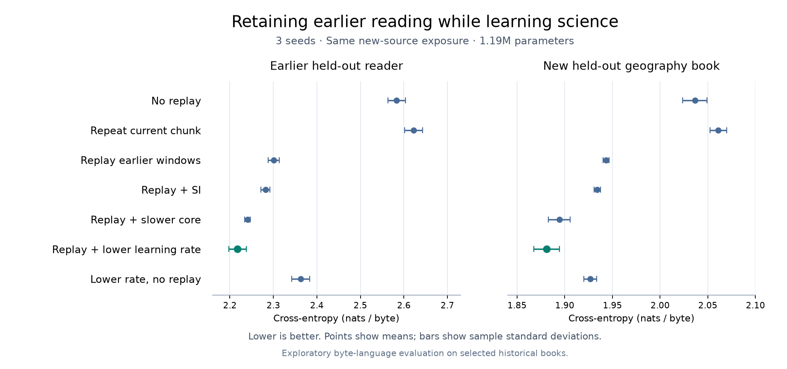

# Controlled retention during live learning

`retention-bench` tests the real native live engine while the observed source distribution changes. It keeps generation active and never trains on the generated text. This measures byte-language retention and transfer to separate books, not mastery of facts or human developmental age.

## Protocol

1. Start one model from random weights and learn the approved reading corpus for 6,000 observed updates. Reservoir replay runs every four updates and SI importance is tracked with penalty strength zero.
2. Save its complete weights, Adam moments, neuron state, speech RNG, source reservoir and consolidation history.
3. Reload that same checkpoint for each intervention. Introduce the selected science book and observe exactly 6,000 more chunks, each up to 128 source byte pairs. An explicit `new` curriculum scope prevents old books from entering the new online stream at EOF.
4. Evaluate both separate held-out books before the shift and every 1,000 later updates using the same fixed strict-FP32 reset-state windows. Each domain uses 16 sequences × 128 targets × 32 batches. Sampled windows may overlap. The final test book never enters this experiment.

The interventions are:

| Arm | Extra updates after the shift | Plasticity change |
| --- | --- | --- |
| `none` | None | Base learning rate 0.0003 |
| `current` | Repeat the current observed chunk every four updates | Same rate |
| `reservoir` | Sample an older observed window every four updates | Same rate |
| `reservoir_si` | Same source reservoir | SI penalty 0.001 |
| `reservoir_slow_core` | Same source reservoir | Embedding/block rate ×0.25; full-rate output head |
| `reservoir_low_lr` | Same source reservoir | Whole-model rate ×0.25 |
| `none_low_lr` | None | Whole-model rate ×0.25 |

`current` controls for doing additional optimizer updates without retrieving old examples. The whole-model low-rate arms test whether slowing the entire learner explains gains otherwise attributed to selective protection of older connections. All arms track SI arrays, including the zero-strength controls, so reported runtime is not the minimum cost of disabling SI entirely. Current and reservoir replay receive the same number of updates, but actual replay byte counts can differ at document tails; these counts are published.

The no-replay/current controls intentionally discard the common checkpoint's source reservoir at the branch. Other starting model state remains identical. There is no automatic promotion or model selection inside this command. Negative forgetting means held-out old-domain loss improved after new learning; positive forgetting means it worsened.

## Run

Prepare the [selected extension](data.md) first. Use fresh output directories:

```powershell
.\build\synapticgenesis.exe retention-bench --train-a data/prepared/development-v2-final/through-stage-3.dat --train-b data/prepared/development-v2-final/stage-4.dat --validation-a data/prepared/development-v2-final/13853.txt --validation-b data/prepared/development-v2-final/12228.txt --steps-a 6000 --steps-b 6000 --seed 1337 --fast --out runs/retention-controls-1337
```

Repeat with seeds 2026 and 31415 to reproduce the declared comparison. Native C++/CUDA performs all learning, replay and evaluation. No external/pretrained model supplies targets. Model size defaults to 1,186,304 parameters (signed LIF); dimension and ALIF options are available for separate experiments. The protocol uses one observed sequence per update and graph generation of 96 bytes every 500 observations.

The output contains initial/common checkpoints, a fixed curriculum and per-arm checkpoint, transcript and evaluation curve. `result.json` records source identities, common-checkpoint identity, losses, source/replay counts, plasticity settings and measured latency. Throughput divides new observed pairs by time spent in update/generation ticks; this excludes evaluation, checkpoint/log I/O, source transition and setup. It is not directly comparable to a batched training throughput measurement or a loop timer that includes those costs.

The independent CLI fixture reloads each arm checkpoint in another native process and verifies reported held-out losses, update counts and new-domain cursors. It also rejects train/evaluation equality and protects existing experiments. Source-preparation checks handle whole-book/paragraph separation; neither these checks nor the experiment rule out paraphrase overlap.

The comparison is exploratory: a few seeds and two small historical language domains cannot establish a universal memory policy, long-term retention, biological fidelity or conversational competence. Recommended development settings should remain explicit and reversible as broader content and skill probes are added.

## Three-seed result and usable profile

The [recorded experiment](../reports/retention-v1.json) used seeds 1337, 2026 and 31415 and the exact source editions in the development manifest. At the end of phase A, mean held-out old loss was 2.26676. The following values are means after the same 6,000 new-source updates; lower byte cross-entropy is better within each column.

| Intervention | Old reader loss | New geography loss | Change in old loss |
| --- | ---: | ---: | ---: |
| No replay | 2.58318 | 2.03655 | +0.31642 |
| Repeat current chunk | 2.62260 | 2.06101 | +0.35584 |
| Replay earlier windows | 2.30062 | 1.94335 | +0.03386 |
| Replay + SI 0.001 | 2.28174 | 1.93406 | +0.01498 |
| Replay + quarter core rate | 2.24055 | 1.89424 | -0.02621 |
| Replay + quarter whole-model rate | **2.21765** | **1.88080** | **-0.04912** |
| Quarter whole-model rate, no replay | 2.36272 | 1.92676 | +0.09596 |



Repeating the current chunk did not explain the memory benefit. Lowering the whole-model rate with replay outperformed the core-only slowdown and SI settings on both held-out domains in each of the three seeds. It also outperformed the lower-rate no-replay control. Thus this evidence supports a simpler conservative later-stage rate plus old-source replay for this workload; it does not establish that selective protection is required or that a particular biological aging mechanism was reproduced. The expanded rate controls followed an initial five-arm pilot, so the comparison is exploratory.

Use the explicit [reading-to-science profile](../data/curricula/reading-to-science.sg) to exercise that setting with the ordinary live command and no SI allocation:

```powershell
.\build\synapticgenesis.exe live --curriculum data/curricula/reading-to-science.sg --validation data/prepared/development-v2-final/13853.txt --out runs/development-replay --seed 1337 --lr 0.0003 --chunk 128 --replay reservoir --replay-capacity 1024 --replay-every 4 --graph --speak-every 500 --tokens 96 --prompt "The bird " --fast --eval-batches 32
```

This profile has two exposure phases: 6,000 updates on the pooled approved reading stages, followed by 6,000 updates on the new science book at one quarter of the base rate. It is a controlled reading-to-science development profile; the separate three-stage foundation schedule remains available for fine-grained reading progression. A child's base rate is inherited independently of the temporary stage multiplier.

One [verified production-profile run](../reports/development-profile-v2.json) preserved 1,024 replay descriptors at the shift, learned from 1,534,902 observed pairs plus 383,563 replayed pairs, and generated 2,304 bytes. Old held-out loss improved from 2.24159 after reading to 2.21085 after science; new held-out loss improved from 2.10960 to 1.87464. The loop took 18.11 seconds on the RTX 5080, including checkpoint/log I/O. Ordinary tick p95 was 5.68 ms and update-plus-96-byte-speech p95 was 22.72 ms in that run. These timings use a different boundary from the benchmark and are subject to host/GPU variability. Generated text remains incoherent, so lower loss has not established useful dialogue.

The plotted dots are means and error bars are sample standard deviations across three seeds, not confidence intervals. To regenerate the figure, run `python scripts/plot_retention.py` in an environment with Matplotlib. Plotting is optional and does not participate in model training.
