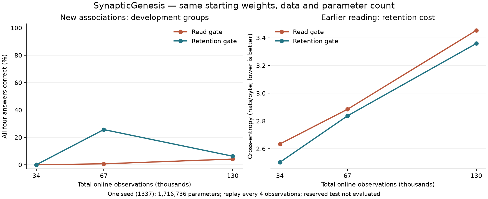

# Input-dependent trace retention

The experimental `--cell selective` changes how the spike trace is stored. Its gate controls how much previous trace survives each byte and how much the new spike replaces it. This tests a different mechanism from `--cell gated`, whose gate changes the emitted readout. The [equations and backward rule](architecture.md#input-dependent-trace-retention) describe the complete implementation.

The two cells have the same 1,716,736 parameters at C256/H512/L4, the same state/cache sizes and identical parameter initialization for a given seed. Zero gates recover the ordinary trace cell. Retention stays in [0,1], giving a convex mixture of the earlier trace and current signed spike. A diagnostic verifies that a nonzero retention gate changes the first layer's stored trace while the read gate leaves that layer's trace unchanged.

The distinction is motivated by the temporal selection discussion in [Mamba](https://arxiv.org/html/2312.00752v2#S3.SS5) and earlier [LSTM forget-gate research](https://sferics.idsia.ch/pub/juergen/FgGates-NC.pdf). This is an original, bounded engineering experiment over our spiking model, not a reproduction of either architecture or a claim of biological equivalence.

## Validation and runtime

Architecture version 5 has its own checked identity. Equal-sized read-gate and retention-gate checkpoints cannot be interchanged. The same live engine supports graph generation, replay, optional SI, saved curriculum history and later lesson admission. Population inheritance copies gate parameters, bounded width growth is initially function-preserving, resource accounting includes all buffers, and old-age death still blocks population learning.

The CPU autograd oracle uses nonzero input-gate weights and signed incoming traces to exercise temporal gradient propagation and the gate's input-gradient path. A second fixture checks answer-emphasized targets. Native tests also compare streamed/chunked/graph inference, zero-gate trace equivalence, disabled-trace LIF equivalence, state/optimizer/speech restarts and replay isolation. The continuous output rejects ternary spike-add and the experimental indexed-spike paging path.

The neuron remains an optional experiment. The default LIF model and existing checkpoint meanings are preserved. Passing numerical and lifecycle checks is not evidence of language competence.

## Matched language and exposure protocol

The selected binding-v2 material is unchanged. Each model starts from scratch with the same seed, reading for 6,000 online observations and receiving 4,000 single-object prerequisite observations. The final two-object stage is declared at birth to last 120,000 observations. Measurements at 34,000, 67,000 and 130,000 total observations compare 24,000, 57,000 and 120,000 binding observations. This tests longer exposure alongside the cell change, because the previous rate and replay experiments did not establish that the earlier exposure budget was sufficient.

The base learning rate is 0.0003, the lesson-stage multiplier is 0.25, answer emphasis is 64, and a 1,024-window reservoir supplies one replay every four observations. Graph speech emits 96 bytes every 500 observations. Both cells receive identical source targets, replay descriptors and generated-byte counts at each measured point. Their generated content can differ and enters their own continuing recurrence, as in the established live protocol. Checkpoints are saved every 5,000 observations and at evaluation endpoints; this save cadence is shared by both arms.

Training-group fit and development-group generalization use the complete four-question binding assay. Earlier-reader loss uses the same independent reader and evaluation batches. The reserved test partition is never scored. Each comparison is one seed; the script allows declared independent repetitions. Time includes the live loop and checkpoint I/O, excluding process setup, probe scoring and initial/final validation.

```powershell
python scripts/selective_experiment.py --out runs/selective-binding-panel
```

The script preserves all three measured checkpoints, source identities, initial-array equality checks, sessions, response-sensitivity audits and seven-round strict-FP32 decode checks. Experiment results must be reported together with any failures; the architecture is not promoted solely on the basis of one favorable score.

## Result: training fit improves, generalization regresses

The paired seed-1337 experiment establishes that both cells can eventually fit this training collection. It also exposes overfitting: the selective cell's development performance improves at the intermediate checkpoint and then deteriorates while training accuracy continues upward.

| Cell | Total online observations | Training groups correct / 432 | Development groups correct / 144 | Earlier-reader cross-entropy |
| --- | ---: | ---: | ---: | ---: |
| Read gate | 34,000 | 1 (0.23%) | 0 (0.00%) | 2.63443 |
| Retention gate | 34,000 | 0 (0.00%) | 0 (0.00%) | 2.50240 |
| Read gate | 67,000 | 2 (0.46%) | 1 (0.69%) | 2.88424 |
| Retention gate | 67,000 | 292 (67.59%) | 37 (25.69%) | 2.83682 |
| Read gate | 130,000 | 413 (95.60%) | 6 (4.17%) | 3.45365 |
| Retention gate | 130,000 | 432 (100.00%) | 9 (6.25%) | 3.35857 |

A group is correct only if all four questions are answered correctly across swapped facts and changed queries. Unconstrained greedy exact-answer development scores equal the table's candidate-scoring group scores at every checkpoint. The development partition holds out object pairings while sharing vocabulary and templates; its 144 groups are related examples, not 144 independent replications. Earlier-reader cross-entropy is in nats per byte, lower is better. Both cells lose earlier-reader performance as the later lesson repeats.



At 67,000 observations, the selective model correctly answers all four variations of this development example:

```text
The key is in the box. The hat is in the bed.
Where is the key?
Answer: box.
```

At 130,000 it answers `bed.` to that question. For the swapped facts, it also changes its previously correct hat answer from `box.` to `bed.`. The [four recorded outputs](../reports/selective-regression-example.json) preserve the actual prompts and answers. This example was selected after evaluation to illustrate the aggregate regression; it is not an additional independent result.

The final models each observe 9,851,391 source next-byte targets, replay 2,660,428 targets in 32,500 replay updates, and emit 24,960 generated bytes. Initial parameters, optimizer and live state match byte-for-byte except architecture/header identity. Source identities and exposure counters also match. The [complete result](../reports/selective-binding.json) includes response-sensitivity audits, checkpoint hashes, all three measurement points and executable identity. Generated text never supplies training targets.

This is one paired seed. It supports a narrower conclusion than a general model improvement: input-dependent retention changes how quickly this model learns the selected associations, but longer exposure still produces poor generalization and forgetting. The favorable intermediate checkpoint is not a successful final model. No automatic early stopping, mastery promotion or population fitness change was introduced; those require a separately declared validation protocol. LIF remains the default.

## Runtime measurements

| RTX 5080 local measurement | Read gate | Retention gate |
| --- | ---: | ---: |
| Sum of the three live-loop segments | 192.13 s | 181.29 s |
| Final segment ordinary tick p50 / p95 | 1.194 / 2.287 ms | 1.119 / 2.143 ms |
| Final segment update plus 96-byte speech tick p95 | 15.055 ms | 15.055 ms |
| Strict-FP32 regular decode median | 304.83 microseconds/byte | 302.88 microseconds/byte |
| Strict-FP32 graph decode median | 114.58 microseconds/byte | 114.31 microseconds/byte |
| Graph capture/setup | 40.31 ms | 39.22 ms |

Training uses TF32 and includes replay, generation, logs and checkpoint I/O inside the timed loop. It excludes process/model setup and initial/final validation. These are one run per architecture with rotated order at the three measurement points, not a repeated throughput benchmark. Tick percentiles are histogram upper bounds with approximately 2.2% relative bin width. Absolute times should not be compared with earlier experiments that used a different save cadence.

Decode uses seven rounds of 1,024 bytes on each final checkpoint, including host sampling, transfers and synchronization, excluding prompt warmup and graph capture. Graph and ordinary decoding produce identical generated bytes, logits and final state within each model. Both architectures cost about 114 microseconds per generated byte with graph decoding; their difference here is below 1%. These measurements do not establish an energy advantage or browser performance.

## Delayed cue control and checks

The [12-run cue panel](../reports/selective-cue.json) tests both cells at 128- and 256-byte delays, with seeds 1337, 2026 and 31415. Every run reaches 100% on 2,048 A/B recall sequences after 2,000 updates; erasing all recurrent state gives 50%. Both use 68,016 parameters at C64/H88/L2. These disposable synthetic models are never ancestors of a language model.

Erasing only the final trace does not consistently erase selective-cell recall: several runs retain almost all accuracy through the remaining membrane state. The control therefore establishes a dependence on recurrent state, not exclusive storage in the final trace. It does not demonstrate object binding or conversation.

The [validation report](../reports/selective-validation.json) records twelve passing native suites, independent CPU gradients, 30 ordinary curriculum restarts, ten answer-weighted restarts, 40 curriculum-extension comparisons and population growth/resource/lifespan tests. Maximum plain and answer-weighted gradient discrepancies are 3.17e-8 and 6.71e-8. Checkpoint architecture identity is enforced even for equal-sized payloads. The scarcity test records two founders dying of old age and releasing their credits; the live-population test rejects further learning after a child's death and preserves its archive.

The [saved parameter diagnostics](../reports/selective-dynamics.json) are observations of weights and state. Selective trace base time constants exclude the input-dependent gate and must not be interpreted as measured memory spans or biological ages.

To reproduce the supporting artifacts after preparing binding-v2 and running the language experiment:

```powershell
python scripts/compare_memory_cells.py --cells gated selective --hidden 88 --delays 128 256 --out runs/selective-cue-panel
python scripts/summarize_selective.py
python scripts/plot_selective.py
```

The collector also reads the validation runs named in its source. The plotting script requires Matplotlib; it does not execute model computation. Raw books and checkpoints remain local, while code, source identities and compact evidence are public.
