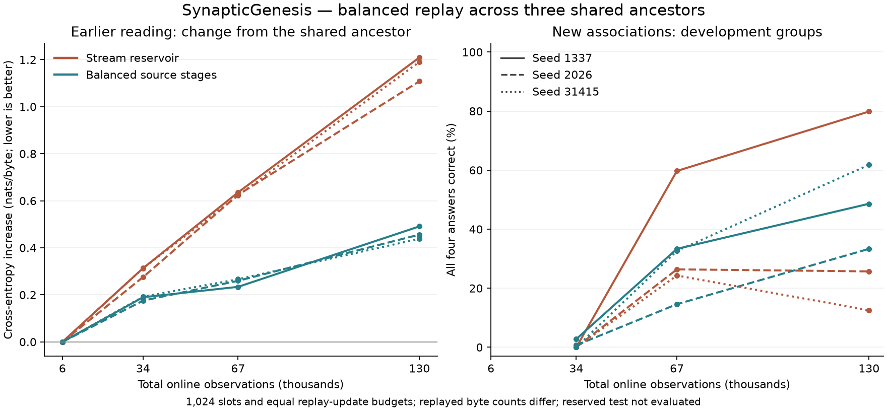

# Sustained replay of earlier source stages

`--replay stage` gives each introduced curriculum source stage a share of a fixed replay-slot budget. The goal is to retain earlier learning while continuing to learn and generate with the same mutable model. It changes which observed examples are rehearsed; the neuron equations, optimizer and inference path are shared with the existing learner.

The earlier long binding experiment exposed a concrete imbalance. With a 1,024-slot stream reservoir, reading windows fell from 180 at 34,000 observations to 91 at 67,000 and 51 at 130,000. At the final checkpoint, 934 slots held the repeatedly presented two-object lessons. Both tested cells lost earlier-reader performance while fitting the newer training examples. These observations motivate testing balanced rehearsal; they do not establish the cause of all forgetting.

[Complementary learning systems research](https://cseweb.ucsd.edu/~gary/258/jay.pdf) motivates interleaving new experiences with earlier knowledge. [Chrysakis and Moens](https://proceedings.mlr.press/v119/chrysakis20a.html) study memory population under imbalanced continual streams. Our explicit source-stage quotas are a separate engineering policy. The project does not reproduce either biological circuitry or that paper's complete class-balancing algorithm.

## Policy and resource bounds

For capacity `K` and `G` introduced stages, each group receives `floor(K/G)` slots; the first `K % G` groups receive one extra slot. A source document belongs to the stage that first introduced it, including when it is observed again in a later `all`-scope stage. Each group maintains its own uniform reservoir over all observed windows from that group.

When a new stage starts, earlier reservoirs are uniformly subsampled to their smaller quotas, retaining their lifetime observation counters. The new group's slots fill only with observed windows. Sampling chooses uniformly among nonempty groups, then uniformly among that group's stored windows. A not-yet-observed source cannot be replayed. Windows enter memory after the current tick's replay, preserving the existing ordering. Answer emphasis follows the original document annotation.

The configured slot count never grows. Sparse groups can leave some capacity unused; at least one slot must be available for every stage in the declared schedule. An extension exceeding that limit is rejected before publishing a changed stream. Three full groups with 1,024 total slots use 342/341/341 descriptors. The checkpoint replay payload uses `8 * (17 + 5*G + 3*M)` bytes for `M` stored windows: 24,832 bytes when those slots are full. This is 128 bytes more metadata than the ordinary 1,024-slot reservoir. No new GPU model buffers are allocated. Source bytes remain separately resident in CPU memory as before.

The CPU module [stage_replay.cuh](../src/stage_replay.cuh) separates immutable layout inspection from mutating reservoir operations. [live_replay.cuh](../src/live_replay.cuh) owns shared cadence and counters; the curriculum admits source groups. C++/CUDA performs all model learning and generation. Replay uses isolated recurrent state with the existing shared parameters and optimizer.

## Start, resume and convert

Prepare the selected source editions first, using a fresh output directory if an older prepared corpus already exists. The preparation script writes a three-stage schedule ending at 6,000 observations:

```powershell
python scripts/prepare_corpus.py --out data/prepared/foundations-stage-replay

.\build\synapticgenesis.exe live --curriculum data/prepared/foundations-stage-replay/curriculum.sg --out runs/stage-replay-founder --updates 2000 --replay stage --replay-capacity 1024 --replay-every 4 --lr 0.0003 --graph --fast

.\build\synapticgenesis.exe live --resume runs/stage-replay-founder/latest.ckpt --curriculum data/prepared/foundations-stage-replay/curriculum.sg --out runs/stage-replay-founder --updates 6000
```

Choose an update target within the supplied schedule and above the saved count. Append-only curriculum extension uses the same `--extend-curriculum` command as before and preserves group histories. `session.json` includes each group's seen/stored window counts, quota, replay updates and target pairs.

An existing ordinary reservoir can explicitly convert **while still in its first curriculum stage**, including its exact ending boundary before the next transition:

```powershell
.\build\synapticgenesis.exe live --resume runs/founder/latest.ckpt --curriculum curriculum.sg --out runs/founder --replay stage --updates 12000
```

At that point every remembered observation belongs to one source group. Conversion preserves all descriptors, observation/replay counters, RNGs, weights, optimizer, recurrent state, optional SI and curriculum history. It is logged as `replay_policy_conversion`. Omit `--replay` on subsequent ordinary resumes. Conversion after advancing to a later stage is rejected: the old stream reservoir does not retain the per-source lifetime counters needed to reconstruct the new policy honestly.

Grouped memory uses **live extension version 5**, independent of the model's neuron architecture version. Its bounded layout stores the existing 16-word policy header, group count, five words per group, then grouped episode triples. Group ranges, quotas, counts and totals are validated, and the whole payload is checksummed. Earlier checkpoint versions remain readable. Population learning and inheritance understand the new live version without changing age, lineage, lifespan or death rules.

## Verification

The native suite exercises quota shrink, earlier sources returning, one-stage equivalence to the original reservoir, seeded inclusion frequencies over 4,000 trials, balanced group selection and malformed payloads. Ten native restart cases cover all five cells with optional SI, graph generation and weighted answers. CLI tests check conversion, read-only tools, valid-checksum invalid policies, admission limits and transactional rejection.

The extension and population tests also run with this policy: repeated lesson admission, exact saved-state comparisons, canonical checkpoint selection, inherited base learning rates, width growth, locks, old-age death and archived inference. See [validation evidence](../reports/validation.md).

## Language comparison protocol

Three declared seeds, 1337/2026/31415, each train one selective-cell ancestor from scratch through 6,000 reading observations. Both replay arms then resume **that exact learned checkpoint**. The stage arm converts its first-stage reservoir before the next curriculum transition. The original selected binding-v2 material, base rate 0.0003, later-stage multiplier 0.25, answer emphasis 64 and total 1,024 slots remain fixed.

Both arms receive the same online targets, one replay update per four observations and 96 generated bytes per 500 observations. The schedule ends at 130,000 online observations, with measurements at 34,000, 67,000 and 130,000. Save cadence is 5,000. New lesson training/development groups and earlier-reader cross-entropy are reported together; the primary endpoint is earlier-reader loss at 130,000. No checkpoint is selected from a favorable intermediate score. The reserved test partition is not evaluated.

Generated content can differ between policies and enters each learner's continuing recurrent state, as in the existing live protocol. Generated bytes never supply training targets. Equal source targets and speech lengths therefore do not imply identical intermediate context states.

Replay target identities and lengths intentionally differ. Equal replay-update counts therefore do **not** imply equal replayed byte counts or wall time; both are measured. Timed live segments include replay, speech, logs and checkpoint I/O, excluding setup and initial/final validation. The common ancestor's training cost is recorded separately. Decode uses seven rounds of 1,024 bytes in strict FP32 on the first seed's final checkpoints.

A preliminary run used independent first-stage training from identical initial arrays. Its first-stage replay descriptors, RNG and exposure counters matched, but learned arrays diverged. It was stopped, with artifacts retained locally, and is not used as a complete policy comparison. The common-ancestor protocol removes that pre-intervention difference. Native numerical parity on short fixtures does not establish bit-reproducible long training trajectories.

At the time of this experiment, the implementation used floating-point atomic accumulation for embedding and normalization gradients. Variable summation order was a plausible contributor to the observed divergence: [NVIDIA documents](https://developer.nvidia.com/blog/controlling-floating-point-determinism-in-nvidia-cccl/) how unordered atomics can change floating-point results. The [pilot evidence](../reports/replay-control-pilot.json) records those array differences without assigning an unverified cause. A shared ancestor fixed the initial-state control; it did not make that binary's subsequent training bit-reproducible. The later [ordered-reduction stage](ordered-reductions.md) investigates and changes this arithmetic separately; the learning results below still refer to their recorded executable.

```powershell
python scripts/replay_experiment.py --out runs/stage-replay-shared-panel
```

The driver writes the protocol before learning, checks actual observation counts before labeling snapshots, preserves the common ancestors, rotates policy order and records checkpoint/executable hashes. Balanced memory remains optional; its learning result must be assessed separately from these mechanism checks.

## Completed three-seed result

At 130,000 observations, balanced replay retains earlier reading better in **all three paired seeds**. Mean earlier-reader cross-entropy is 2.71443, versus 3.42205 for the ordinary reservoir. Relative to each shared ancestor, the mean increase is +0.46196 versus +1.16959 nats per byte: a 60.5% reduction in this measured forgetting increase. Earlier-reader performance still deteriorates in every arm; the policy reduces forgetting without eliminating it.

| Seed | Replay policy | Final earlier-reader loss | Training groups correct | Development groups correct |
| --- | --- | ---: | ---: | ---: |
| 1337 | Stream reservoir | 3.45097 | 100.00% | 79.86% |
| 1337 | Balanced stages | 2.73271 | 99.31% | 48.61% |
| 2026 | Stream reservoir | 3.34990 | 100.00% | 25.69% |
| 2026 | Balanced stages | 2.69768 | 96.99% | 33.33% |
| 31415 | Stream reservoir | 3.46530 | 99.77% | 12.50% |
| 31415 | Balanced stages | 2.71290 | 100.00% | 61.81% |

Mean development group accuracy is 47.92% with balanced stages and 39.35% with the stream reservoir, but the paired effect varies substantially: -31.25, +7.64 and +49.31 percentage points. Two seeds improve and one worsens. Three ancestors and one continuation per policy/ancestor are insufficient to establish a reliable generalization advantage or a statistically precise effect. Training-group fit averages 98.77% and 99.92%, respectively.

Each training group contains four questions; 432 groups are evaluated. Each of the 144 development groups requires four correct answers across swapped facts and changed queries. Development holds out object pairings while sharing vocabulary and templates, so these are related examples of one narrow skill. Unconstrained greedy exact-answer group accuracy agrees with candidate-scoring group accuracy at all final checkpoints. This does not establish general conversation, broader reasoning or automatic developmental mastery.



The [complete 59-command experiment](../reports/stage-replay-language.json) retains all 18 measurement rows, shared-ancestor hashes and scores, response-sensitivity audits, timings and decode results. The [compact summary](../reports/stage-replay-summary.json) gives each paired endpoint and its cost. Earlier favorable or unfavorable runs are not erased: the preceding selective-trace experiment and stopped control pilot remain separately identified.

## Measured cost and remaining limits

| Local RTX 5080 measurement | Stream reservoir | Balanced stages |
| --- | ---: | ---: |
| Mean live-loop time after the common ancestor | 172.01 s | 172.96 s |
| Total replay optimizer updates, including ancestor history | 32,500 | 32,500 |
| Total replay target-byte pairs | 2,660,428 | 2,810,217 |
| Saved replay-policy payload | 24,704 bytes | 24,832 bytes |
| Final-segment ordinary tick p95, range across seeds | 2.097–2.143 ms | 2.238 ms |
| Final-segment 96-byte speech tick p95, range across seeds | 14.108–14.733 ms | 14.417–15.055 ms |
| First-seed strict-FP32 graph decode median | 114.31 microseconds/byte | 114.46 microseconds/byte |

Both arms observe 9,851,391 source target-byte pairs and emit 24,960 generated bytes over their complete histories. Balanced replay rehearses 5.63% more target bytes because the selected windows differ in length. Average measured loop time is 0.55% higher, a small difference in this local experiment rather than a repeated throughput estimate. The common reading ancestor takes 9.21–9.31 seconds per seed and is recorded separately. Model dimensions and GPU allocations remain unchanged: C256/H512/L4, 1,716,736 parameters. Saved metadata grows by 128 bytes; the table does not measure total process RAM or allocator capacity.

Tick percentiles are histogram upper bounds with about 2.2% relative bin width. Training uses TF32. First-seed decode timings include host sampling, transfers and synchronization, exclude prompt warmup and graph capture, and use seven rounds of 1,024 bytes. Capture takes 39.47/39.87 ms. Within each model, graph and ordinary decoding produce identical generated bytes, logits and final recurrent state. The two replay policies have essentially the same measured decode cost.

These results support optional source-stage balance for this curriculum's retention problem. They do not justify changing the default neuron cell or universally replacing reservoir replay. The remaining work includes reducing residual forgetting, improving the consistency of unseen-combination performance, and validating broader language skills before connecting skill mastery to promotion or reproduction.

After completing the experiment and validation runs, regenerate the compact reports and figure with:

```powershell
python scripts/summarize_replay.py
python scripts/plot_replay.py
```

Matplotlib is required only for the figure. Model training and inference remain native C++/CUDA.
