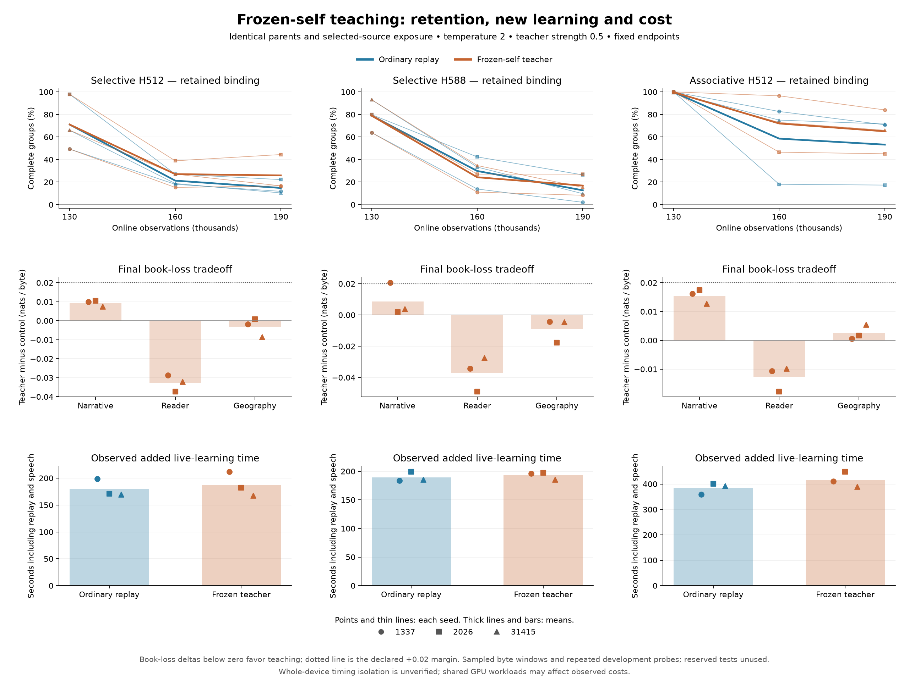

# Frozen-self guidance during narrative learning

## Declared comparison

The [narrative study](narrative-learning.md) improved book prediction while losing development binding skills in every model. The [teacher runtime](live-teachers.md) now supports frozen probability guidance during observed-source replay. This comparison tests whether that mechanism reduces the measured forgetting while allowing new learning.

Every existing final parent is included: selective H512, selective H588 and associative H512, each at seeds 1337, 2026 and 31415. All nine start from their own authenticated 130,000-observation checkpoint. Each parent supplies two branches: ordinary actual-target replay and teacher-assisted replay. The latter uses **one frozen copy of its own pre-narrative model**, temperature **2**, strength **0.5** and actual-target coefficient **1**. These settings are fixed before either the shortened rehearsal or the full comparison. This isolates retention guidance; it does not test two-parent inheritance, teaching by another individual, or automatic teacher selection.

The immutable teacher bundle covers the first three selected source stages. It contributes only when stage replay selects previously observed reading, prerequisite or binding windows. New narrative windows use their actual targets without teacher guidance. Both objectives receive the existing answer weights. The previous model may carry mistakes, and its predictions are not used as evaluation answers.

## Matched exposure and costs

The same seven selected books enter one pooled append-only stage, with 128-byte chunks, base learning rate 0.0003 and stage multiplier 0.25. Old lesson answer emphasis remains 64; new books use one. The inherited 1,024-slot replay reservoir uses four equal quotas and one replay update every four new observations. Each branch retains the parent's optimizer, source/replay history and RNGs. The existing source-boundary reset applies when the new stage begins. New speech is 96 bytes every 500 observations with the original shared-state prompt; generated text never supplies targets.

Learners use TF32 and teachers use strict FP32. The additional teacher allocation is capped at 512 MiB and measured separately. All GPU commands run sequentially. Architecture order rotates by seed; branch order alternates by seed index plus its canonical architecture index, so each architecture includes both branch orders across the three seeds. Complete live-loop costs include replay, speech, logging and saves, while package creation, setup and separate assessments are excluded. The comparison pays for fresh ordinary controls using the same executable. Their full checkpoints are checked against the earlier narrative study rather than assuming compatibility from a smaller fixture.

All branches are assessed at 130,000, 160,000 and **190,000** observations. There is no early stopping, coefficient search, best-seed selection or change based on intermediate scores. Parent files are copied/read, never overwritten.

## Measures and decision rule

The primary endpoint is the teacher-minus-control difference in complete development binding-group accuracy at observation 190,000, reported for every pair and as a mean within each architecture. The 576 questions form 144 reversal groups; all four answers must be correct. Greedy exact-answer groups and context-erased accuracy remain separate measurements.

Report held-out *The Velveteen Rabbit*, earlier-reader and geography byte losses separately, plus every fixed sample and total live cost. Book evaluations use the existing 32 deterministic batches of 16 reset-state 128-byte windows. Two prompts at each endpoint produce 384 bytes with temperature 0.8, top-k 40 and seed 42. Final decode measurements use seven rounds of 512 bytes and verify graph/ordinary output and state agreement. The two reserved books and reserved binding split are not scored.

The declared engineering gate for this setting is **higher final binding-group accuracy in all nine matched pairs**, while every assessed book loss stays within **+0.02 nats/byte** of its matched control and new narrative loss improves from that model's own parent. Passing that gate would identify a promising setting on these repeated development measures. It would not establish broad reliability, useful conversation, lifelong retention or biological development. Regressions remain part of the result even if a mean improves.

The independent execution audit must verify selected-source bytes, unchanged parent/bundle files, native command coverage, exactly matched observed/replay exposure and descriptors, teacher eligibility/counters, quota changes and sample identity. A shortened rehearsal must produce identical uninterrupted/resumed checkpoint files for both branches at all three model shapes. The shared fixed four-question CPU oracle is run on every final model with its unchanged score tolerance. Any threshold-sensitive failures stay visible, alongside the existing cold first-Adam-step objective failure.

## Reproduce

```powershell
python scripts/teacher_retention_experiment.py --smoke --parent runs/associative-long-smoke --previous runs/narrative-smoke --out runs/teacher-retention-smoke
python tests/teacher_retention_experiment.py --root runs/teacher-retention-smoke --continuation-control

python scripts/teacher_retention_experiment.py --out runs/teacher-retention-panel
python tests/teacher_retention_experiment.py --root runs/teacher-retention-panel
python tests/binding_learned_oracle.py --root runs/teacher-retention-panel
```

The full driver journals 333 native commands across 18 branches and 54 checkpoint records. Baseline assessments are run once per parent and copied identically to its two branches. The rehearsal uses the existing seed-1337 short-run parents, endpoints 256/384, two book-evaluation batches and 64-byte samples; it checks execution only. No new corpus or pretrained model is introduced.

The [completed rehearsal audit](../reports/teacher-retention-smoke.json) verifies all 111 main commands, six branches and 18 checkpoint records. Every ordinary branch endpoint matches its earlier narrative-study checkpoint byte for byte. Six additional uninterrupted runs match all six resumed final files exactly. Source/replay descriptors and exposure are identical between each pair; teaching counters equal replay on the eligible first three source groups. Re-running the audit revalidates existing continuation evidence instead of discarding it. The earlier full narrative execution audit also still passes after moving grouped checkpoint evidence into the common diagnostic reader.

## Observed timing condition during the full run

Other desktop applications held GPU contexts during the full comparison. The first 1337/selective control segment took 96.83 seconds, compared with 45.62 seconds in the earlier study, while its complete 160,000-observation checkpoint matched byte for byte. Whole-device isolation is therefore not established. The study continued with the same fixed learning settings, branch order and endpoints; observed durations and ratios need this qualification and cannot establish intrinsic teacher overhead or a speedup. No other applications were stopped or reconfigured for this experiment.

## Completed comparison: partial retention gains, declared gate fails

The full run completed **333 native commands, 18 branches and 54 checkpoint assessments**. Frozen-self guidance improves final complete binding accuracy in **eight of nine pairs**, but the declared setting **fails its acceptance rule**. Eight pairs satisfy the book-loss margin; seven satisfy all three requirements together. Every teacher branch improves narrative loss from its own parent, while predicting the new narrative book slightly worse than its matched ordinary control.

| Complete development binding, mean of three seeds | Pre-narrative parent | Ordinary replay at 190,000 | Frozen-self guidance at 190,000 | Paired improvement |
| --- | ---: | ---: | ---: | ---: |
| Selective H512 | 71.06% | 14.81% | 25.93% | +11.11 percentage points |
| Selective H588 | 78.94% | 12.73% | 16.90% | +4.17 percentage points |
| Associative H512 | 99.77% | 53.24% | 65.05% | +11.81 percentage points |

The two failed pairs matter. Associative seed 31415 retains **65.97%** with teaching versus **71.53%** with ordinary replay, a **5.56-point regression**. Selective H588 seed 1337 improves binding, but its narrative loss increases by **0.020597 nats/byte** relative to the control, exceeding the unchanged **0.02** margin. The remaining pairs pass this bounded engineering rule; their success does not remove either failure. All teacher branches still retain less binding skill than their own parents.

Teacher guidance improves the earlier-reader loss in all nine pairs. Geography effects are mixed. Mean teacher-minus-control narrative losses are **+0.009325**, **+0.008717** and **+0.015438 nats/byte** for selective H512, selective H588 and associative H512 respectively. These are sampled reset-window losses on repeatedly used development books, not evidence of general conversation or lifelong retention.



The [complete records](../reports/teacher-retention-language.json) and [summary](../reports/teacher-retention-summary.json) preserve every endpoint and fixed sample. The [qualitative review](../reports/teacher-retention-sample-review.json) reads and authenticates **all 36 final continuations**. They contain recognizable vocabulary mixed with broken clauses, invented spellings and repeated lesson patterns. None provides sustained coherent prose. This review is not blinded or a standardized language-quality benchmark.

## Execution, exposure and numerical checks

The [execution audit](../reports/teacher-retention-execution.json) passes. Every branch observes **7,677,365 new target-byte pairs**, replays **1,437,145 pairs** in 15,000 replay updates, and generates **11,520 live bytes** during the added 60,000 observations. Selected-source identities, replay descriptors, parent checkpoints and teacher bundles remain unchanged. All **18 ordinary endpoint checkpoints** match the earlier narrative study byte for byte. Final graph and ordinary generation agree exactly in the tested decode runs.

Each teacher branch applies guidance during **11,226 replay updates** covering **954,073 target-byte pairs** from the three eligible earlier source groups. No new narrative window or generated speech is used as teacher-grounded evidence. The original full-buffer runtime used 43,547,648, 49,302,976 and 52,161,184 additional explicit GPU bytes for the three respective one-teacher shapes. Later storage optimizations require their own compatibility evidence; they are not part of these recorded training costs.

Observed mean live-loop durations are **179.65 / 187.10 seconds** for selective H512, **189.53 / 193.07 seconds** for selective H588 and **384.25 / 416.09 seconds** for associative H512, each listed as ordinary / teacher. These include replay, speech, logs and saves. Shared desktop GPU use prevents interpreting the differences as isolated teaching overhead or a speedup; the same qualification applies to decode timings in the report.

The [independent CPU check](../reports/teacher-retention-learned-oracle.json) covers four fixed development questions for each final model. All **72 greedy answers** agree. Seventeen models pass the original `3e-5` score tolerance. Seed 1337's wider selective ordinary control fails at **0.00620496**; it has the same complete checkpoint and error as the prior narrative study's [threshold-sensitive case](narrative-learning.md#numerical-limitation-and-diagnosis). The check returns an unsuccessful exit and retains the failure. This is not a full development CPU audit. The separate strict cold first-Adam-step objective failure also remains unchanged.

Frozen-self teaching therefore has a measured but inconsistent retention benefit on this curriculum. It remains experimental at the declared setting. Reliable retention, coherent language, learning-capacity preservation, two-parent teaching benefits and improved descendants are still unresolved.
