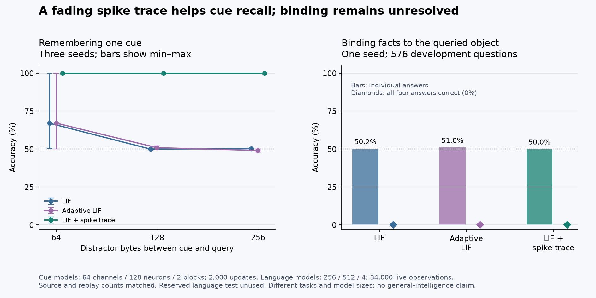

# Learned fading spike traces

The optional `--cell trace` adds a decaying signed spike trace and a learned readout gain to each LIF neuron. Hard spikes remain, while the output projection receives both immediate spikes and their recent history. The [equations and checkpoint semantics](architecture.md#filtered-spike-cell) distinguish this from adaptive thresholds and explain the additional state. LIF remains the default.

The mechanism is motivated by [persistent postsynaptic responses with different decay times](https://neuronaldynamics.epfl.ch/online/Ch3.S1.html). This implementation uses byte steps and a normalized signed filter, rather than biological conductances or human developmental ages.

## Controlled memory result

The native delayed-cue task presents `A` or `B`, then independently sampled digit distractors, then `?`. Only the queried cue is a training target. Labels are balanced and randomly permuted across batch rows. Evaluation uses a different fixed sequence stream. These are disposable synthetic models; none supplies language-model weights or population ancestors.

The recorded comparison fixes 64 channels, 128 neurons per block, two blocks, batch 32, 2,000 updates and learning rate 0.001 with TF32 training. Common parameters initialize identically within a seed; ALIF and trace each add 512 parameters to the 66,624-parameter LIF baseline. The three cells see the same training and evaluation examples for each seed/delay. Cell order rotates between seeds. Three seeds and three delays give 27 runs, each evaluated on 2,048 sequences.

| Distractor bytes | LIF mean accuracy | Adaptive LIF mean accuracy | LIF with trace mean accuracy |
| --- | ---: | ---: | ---: |
| 64 | 66.99% | 67.09% | 100% |
| 128 | 49.97% | 50.85% | 100% |
| 256 | 50.23% | 49.06% | 100% |

The trace cell reached 100% in each of its nine runs. Clearing all recurrent state before the query returns every cell to exactly 50%. Clearing only the trace reduces accuracy to 50–84.18%, depending on the run: some cue information also remains in the membrane state after processing with the trace. These interventions show state dependence without claiming that all memory resides in one array. An earlier exploratory trace run at delay 128 scored 99.12%; repeated GPU training is not bitwise deterministic. The fixed three-seed panel is reported in full, including failed baseline seeds.

This is evidence of improved one-bit cue recall under this training budget. It is not a demonstration of language understanding, efficient event-driven execution, persistent semantic knowledge or biological intelligence. [Full results](../reports/trace-memory.json).

```powershell
python scripts/compare_memory_cells.py --out runs/trace-memory-panel
```

## Language result and latency

The full-size cells were independently trained from scratch on the same [binding-v2 curriculum](binding.md), seed 1337. Each observed 2,747,379 source pairs in 34,000 updates, replayed 811,290 pairs in 8,500 updates and generated 6,528 bytes. The initial common parameters were verified byte-identical; extra trace/adaptation parameters differ as specified. All runs used answer emphasis 64, the same quarter-rate later stages and the same replay reservoir. No reserved test evaluation was performed.

| Cell | Development question accuracy | All four answers correct | Earlier-reader loss, nats/byte |
| --- | ---: | ---: | ---: |
| LIF | 50.17% | 0% | 2.65942 |
| Adaptive LIF | 51.04% | 0% | 2.77155 |
| LIF with trace | 50.00% | 0% | 2.68424 |

All three also remain near 50% on training-partition questions and pass zero complete groups. This rules out describing the problem as only held-out generalization. Better isolated cue memory has not solved query-dependent binding. The comparison has one language seed per cell and does not establish a general architecture ranking. [Language, initialization and timing evidence](../reports/trace-binding.json).

The trace live loop took 54.49 seconds on the local RTX 5080. Its ordinary update-tick median/p95 was 0.921/5.932 ms; update plus 96-byte speech median/p95 was 17.904/24.246 ms. The loop includes replay, speech, logs and stage/checkpoint I/O, but excludes model setup and initial/final validation. Percentiles use approximately 2.2%-width histogram bins.

Separate strict-FP32 decode used seven 1,024-byte rounds after warmup, alternating ordinary and graph execution. Trace graph decoding took a median 147.33 microseconds per byte versus 373.86 without graph capture, a 2.54x local speedup. Generated bytes and final logits/state matched exactly. Timing includes host sampling, transfers and synchronization; capture and prompt setup are excluded. Default LIF graph decoding took 140.31 microseconds per byte in this measurement. The trace adds computation and does not establish a speed or energy advantage over LIF.

Use the documented binding command with `--cell trace` or `--cell alif` and a fresh output directory. To reproduce the diagnostic commands for each resulting checkpoint:

```powershell
.\build\synapticgenesis.exe language-probes --checkpoint runs/binding-trace-1337/latest.ckpt --probes data/prepared/binding-v2/train.sgprobe --output runs/binding-trace-1337/train-probes.json
.\build\synapticgenesis.exe decode-bench --checkpoint runs/binding-trace-1337/latest.ckpt --tokens 1024 --rounds 7 --out runs/binding-trace-1337/decode
```



## Integration checks

All ten native suites pass. Independent CPU autograd agrees with trace gradients within 5.22e-8, or 6.71e-8 with weighted answer targets. The checks include signed nonzero boundary state, spike activity regularization, optimizer updates, disabled-trace recovery of LIF, chunk versus step execution and CUDA graph state.

The curriculum integration uses 73 native process invocations, covering 18 ordinary and six answer-emphasized restart cases across all three cells with optional SI. Generated bytes match; maximum complete-state discrepancy is 7.46e-9. Probe tests cover independent forward scores, greedy output and rejection of incompatible ternary/paging paths. Architecture checks reject ALIF/trace checkpoint mixing despite their equal-sized layouts.

The trace population test covers 17 native invocations, including two parents, bounded width growth, inherited base rates, live teaching, restart, selection, parent/child old-age death and refused learning after death. A separate 12-command trace scarcity test admits five children under a 1 MiB virtual budget, refuses all births at zero budget, tightens selection as resources shrink and verifies that two founders' old-age deaths release credits. The native growth test verifies unchanged predictions at birth and subsequent learning by newly added outgoing weights. Batch prefix-policy persistence and explicit overrides also pass for all three cells. [Validation evidence](../reports/trace-validation.json).
